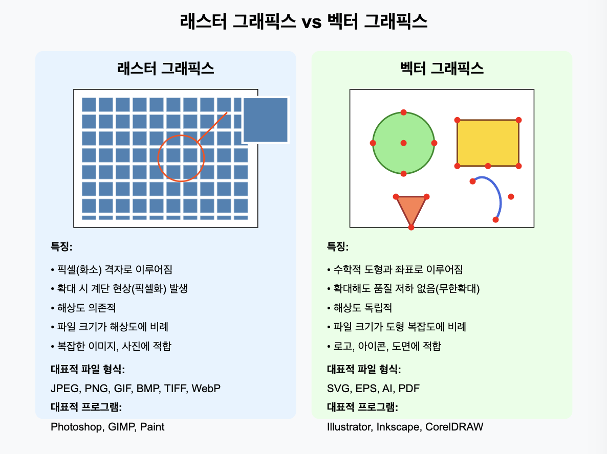
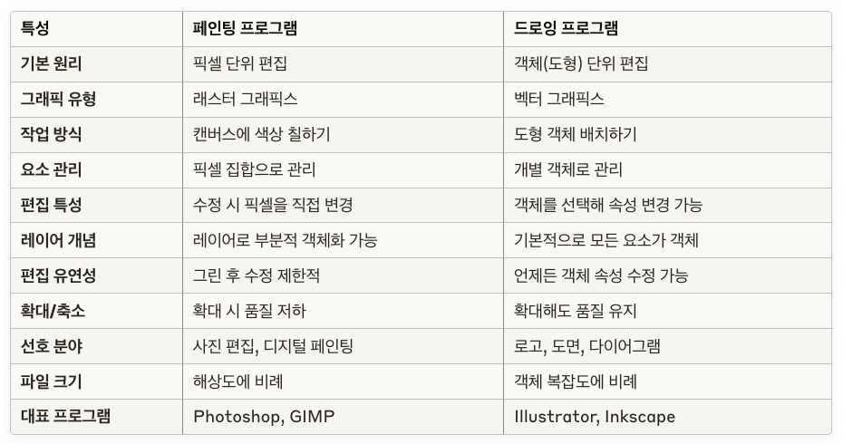
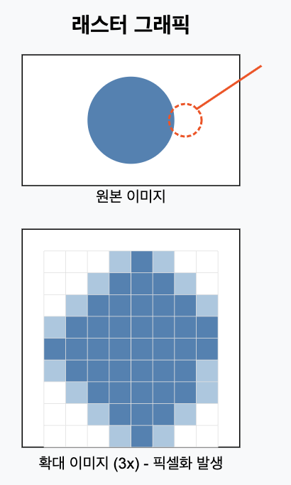
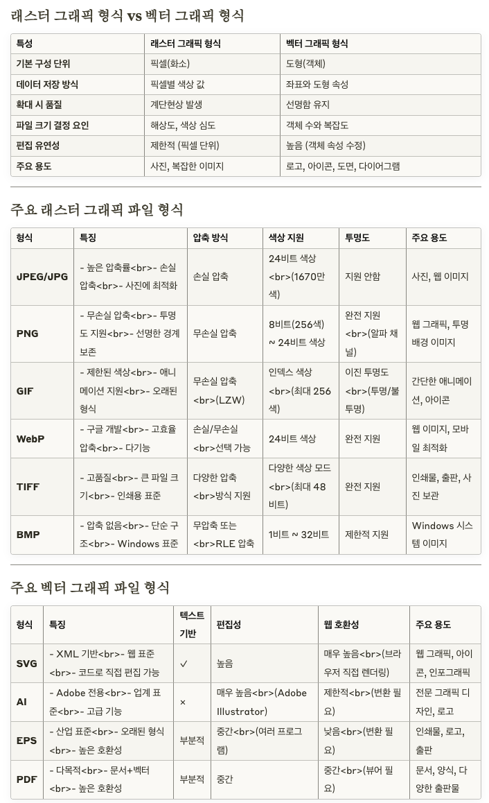

# 레퍼런스

- [컴퓨터 그래픽스 입문 (위키독스)](https://wikidocs.net/230978)
- 원문과 추가 내용을 정리합니다.

---

# 1.1 페인팅과 드로잉

## (1) 3D 그래픽과 2D 이미지

> 이 책의 주요 초점은 3차원(3D) 그래픽스로, 작업의 대부분은 장면의 3D 모델을 생성하는 데 중점을 둔다. 그러나 궁극적으로 컴퓨터 그래픽스 프로젝트의 최종 결과물은 거의 모든 경우에 2차원 이미지이다. 물론 2D 이미지의 직접적인 생성과 조작도 그 자체로 중요한 주제다. 게다가 많은 아이디어들이 2차원에서 3차원으로 전이된다. 따라서 2D 그래픽부터 시작하는 것이 타당하다.

- 3D 작업을 해도 결국 결과물은 모니터나 출력물 같은 ‘2D 이미지’로 표현된다.
- 예를 들어, 멋진 3D 애니메이션을 만들더라도, 실제로 우리가 보는 건 화면에서 보이는 2D 형태의 영상
- 2D 그래픽이 기초가 되어야 한다는 말은, 마치 요리를 처음 배울 때 기본 재료 손질(2D)을 잘 알아야 더 복잡한 코스 요리(3D)를 잘 만들 수 있는 것과 비슷한 이치

## (2) 픽셀과 색상 표현 방식

> 컴퓨터 화면에 표시되는 이미지는 픽셀(pixel)들로 구성된다. 화면은 행과 열로 배열된 직사각형의 픽셀 격자(grid)로 이루어져 있다. 픽셀은 개별적으로 쉽게 볼 수 없을 정도로 작다. 사실, 매우 고해상도 디스플레이의 경우, 사실상 보이지 않게 된다. 주어진 시간에 각 픽셀은 오직 하나의 색상만 표시할 수 있다. 요즘 대부분의 화면은 24비트 색상을 사용하는데, 여기서 색상은 빨강, 초록, 파랑의 세 가지 8비트 숫자로 지정되어, 이 세 가지 ‘기본’ 색상의 조합으로 화면에 표시될 수 있는 모든 색상을 만들 수 있다. 다른 형식도 가능한데, 예를 들어 회색조(grayscale)는 각 픽셀이 회색 음예 중 하나이며 픽셀 색상은 검은색에서 흰색까지의 회색 단계 수준을 지정하는 하나의 숫자로 주어진다. 일반적으로 256단계의 회색이 사용된다. 초기 컴퓨터 화면은 색인화된 색상(indexed color)을 사용했는데, 여기서는 보통 16개나 256개의 제한된 색상 세트만 표시될 수 있었다. 인덱스 색상 디스플레이의 경우, 가능한 색상의 번호가 매겨진 목록이 있고, 픽셀의 색상은 색상 목록에서의 위치나 인덱스를 나타내는 정수로 지정된다.

- **픽셀(Pixel)**: “화소”라고도 부르며, 화면을 이루는 가장 작은 점
- **24비트 색상**: 빨강(R), 초록(G), 파랑(B) 각각 8비트씩, 즉 0부터 255까지 총 256단계로 표현. 이 세 값의 조합으로 다양한 색을 만들어냄.
- **회색조**: 글자 그대로 흑백에 가까운 ‘회색’만 표현하는 방식. 사진의 명암처럼 ‘어두움~밝음’만으로 표현
- **색인화된 색상**: 제한된 색상 팔레트(예: 256색)에서 색 번호를 불러오는 방식. 오래된 게임(도스 시절)이나 간단한 애니메이션 GIF 같은 곳에서 많이 사용

## (3) 프레임 버퍼와 실시간 화면 반영

> 어떤 경우에도 화면상의 모든 픽셀의 색상 값은 프레임 버퍼(frame buffer)라는 큰 메모리 블록에 저장된다. 화면상의 이미지를 변경하려면 프레임 버퍼에 저장된 색상 값을 변경해야 한다. 화면은 초당 여러 번 다시 그려지므로, 프레임 버퍼 내의 색상 값이 변경된 직후에 거의 즉시 화면 상의 픽셀의 색상이 일치하도록 변경되고, 디스플레이에 표시된 이미지가 변경된다.

- **프레임 버퍼(frame buffer)**: “화면의 그림”을 데이터로 담고 있는 메모리 공간.
- 컴퓨터가 **프레임 버퍼의 색상 값을 수정**하면, “실시간으로”(아주 빠르게) 화면에 반영
- 마치 사진이 찍힌 필름을 바꾸면 새 사진이 나타나는 것과 비슷

## (4) 래스터 그래픽스의 기원

> 이러한 방식으로 사용되는 컴퓨터 화면은 래스터 그래픽스(raster graphics)의 기본 모델이다. ‘래스터’라는 용어는 기술적으로 구형 진공관 컴퓨터 모니터에서 사용된 메커니즘—전자빔(electron beam)이 픽셀의 행을 따라 움직이면서 픽셀을 발광시켰다—을 가리킨다. 전자빔의 경로를 휘게 하는 강력한 자석에 의해 화면 전체로 전자빔이 이동했다. 빔이 강할수록 픽셀의 발광이 밝아지므로, 전자빔의 강도를 조절함으로써 픽셀의 밝기를 제어할 수 있었다. 프레임 버퍼에 저장된 색상 값은 전자빔의 강도를 결정하는 데 사용되었다. (컬러 화면의 경우, 각 픽셀은 붉은색 점, 녹색 점, 파란색 점을 가지고 있으며, 이들은 전자빔에 의해 따로 조명되었다.)

- **래스터 그래픽스(raster graphics)**: “픽셀 단위”로 이미지를 표현하는 방식
- 예전 CRT 모니터(브라운관 TV) 같은 곳에서는 **‘전자빔을 이용해’** 화면을 순차적으로 그려서 이미지가 표현되었음
- 전자빔의 세기를 조절해 픽셀이 밝아졌다 어두워졌다 하는 개념인데, 이제는 LCD나 OLED처럼 다른 방식의 디스플레이가 많지만, 여전히 **‘픽셀 격자 + 프레임 버퍼’** 개념은 동일하게 유지

## (5) 현대 디스플레이와 래스터 구조

> 현대의 평면 스크린 컴퓨터 모니터는 그와 같은 의미의 래스터는 아니다. 이동하는 전자빔이 없으며, 픽셀의 색상을 제어하는 메커니즘은 화면 종류에 따라 다르다. 그러나 화면이 픽셀로 구성되어 있고, 모든 픽셀에 대한 색상 값이 프레임 버퍼에 저장된다. 픽셀 격자로 구성된 이미지와 각 픽셀에 대한 수치 색상 값을 포함하는 개념이 래스터 그래픽스를 정의한다.

- LCD, LED, OLED 등 **요즘 디스플레이**는 전자빔이 왔다 갔다 하지는 않지만, **픽셀 단위로 이미지를 표현한다는 점**은 동일
- 결국 **‘래스터 그래픽스’** 란, “격자 형태(픽셀 집합) + 픽셀마다 색상 정보를 갖고 있음” 이라는 핵심 개념을 뜻함

## (6) 벡터 그래픽스의 개념

> 컴퓨터 화면에 표시되는 이미지는 픽셀로 표현되지만, 개별 픽셀의 색상을 지정하는 것이 항상 이미지를 생성하는 최선의 방법은 아니다. 다른 방법은 이미지가 포함하고 있는 기본 기하학적 객체, 즉 선, 원, 삼각형, 사각형과 같은 도형을 지정하는 것이다. 이미지를 그것이 포함하고 있는 기하학적 도형의 목록으로 표현하는 것이 벡터 그래픽스(vector graphics)의 정의다. 더 흥미롭게 만들기 위해, 도형은 선의 두께나 사각형을 채우는 색상과 같은 속성(attribute)을 가질 수 있다. 물론, 모든 이미지가 간단한 기하학적 도형으로 구성될 수 있는 것은 아니다. 이 접근법은 아름다운 석양의 그림(또는 대부분의 사진 이미지)과 같은 경우에는 통하지 않을 것이다. 그러나 건축 설계도나 과학 일러스트레이션과 같은 많은 유형의 이미지에 잘 작동한다.

- **벡터 그래픽스(vector graphics)**: 이미지를 “수학적 도형(라인, 원, 삼각형 등)”의 집합으로 표현
- 예: “원의 중심은 (x, y), 반지름 r, 선색 검정, 두께 2” 와 같이 **기하학적 정보**를 저장하는 방식
- 사진이나 복잡한 그림(자연 풍경 등)은 너무나 다양한 색조/형상을 갖고 있기 때문에, 벡터로 전부 표현하기 어려움
- 하지만 **도형 위주의 도면이나 로고**, 간단한 일러스트 등은 벡터로 훨씬 효율적으로 관리할 수 있음

### 질문) 이렇다 해도 어차피 픽셀로 표현되는 것 아닌가?

- 모든 그래픽은 결국 디스플레이에서 ‘픽셀(화소)’ 형태로 보이게 된다는 점에서는 맞습니다. 하지만 ‘벡터 그래픽’과 ‘래스터 그래픽’의 차이는 **‘이미지를 내부적으로 어떻게 표현하고, 어떻게 다루느냐’** 에 있음
- 우리가 모니터나 스마트폰 화면에서 보는 최종 이미지는 무조건 픽셀 단위로 표시됨.
  벡터 그래픽이든 래스터 그래픽이든 최종적으로는 컴퓨터가 픽셀로 “그려서” 보여줘야 함.
  예를 들어, 벡터 이미지 소프트웨어(일러스트레이터 등)에서 ‘원의 중심(x, y), 반지름 r’ 같은 정보를 가졌다고 해도, 화면에 실제로 원이 표현될 때는 컴퓨터가 그 원을 “픽셀 기준”으로 변환(래스터라이즈)해서 표시
- 그러나 내부 표현 방식이 다름
- 래스터(Raster) 그래픽: 이미지가 “픽셀 덩어리”로 직접 표현됨. 즉, “(100, 200) 위치의 픽셀은 빨강, (101, 200) 위치는 파랑...” 식으로 모든 픽셀의 색 정보를 갖고 있음.
- 벡터(Vector) 그래픽: 이미지가 “수학적 기하 도형” 정보로 표현됨. 즉, “여기에서 여기까지 직선 하나, 색상은 #000000, 두께 2pt” 같이 도형의 정의만 갖고 있음.
- 결국 개념의 차이, 벡터 파일은 내부적으로 “도형/선”을 저장 (설계도면) → 디스플레이할 때 픽셀로 바꿔 그림. 래스터 파일은 처음부터 “픽셀별 색상 정보”를 그대로 저장

## (7) 초창기 벡터 디스플레이의 원리

> 실제로 컴퓨팅의 역사 초기에는 벡터 그래픽이 컴퓨터 화면에서 직접 사용되기도 했다. 최초의 그래픽 컴퓨터 디스플레이가 개발되었을 때, 래스터 디스플레이는 실용적이지 않을 정도로 느리고 비쌌다. 다행히도, 진공관 기술을 다른 방식으로 사용할 수 있었다—전자빔을 그 선을 따라 이동시킴으로써 화면에 직접 선을 그릴 수 있었다. 벡터 그래픽 디스플레이는 화면에 나타나야 할 선의 디스플레이 목록을 저장했다. 화면의 점이 전자빔에 의해 비춰진 후에 매우 짧은 시간 동안만 빛날 것이기 때문에, 그래픽 디스플레이는 디스플레이 목록을 계속해서 반복하여 목록의 모든 선을 지속적으로 다시 그렸다. 이미지를 변경하기 위해서는 디스플레이 목록의 내용을 변경하기만 하면 되었다. 물론, 디스플레이 목록이 너무 길어지면, 선이 다음 차례에 다시 그려지기 전에 눈에 띄게 희미해지기 시작하여 이미지가 깜박거리기 시작할 것이다.

- **옛날 벡터 디스플레이**: CRT 모니터처럼 전자빔을 쏘되, 이번에는 ‘픽셀 단위로’가 아니라 ‘직접 도형(선)을 그리듯’ 이동시켜서 화면에 표시
- **디스플레이 목록(Display list)**에 “이 선은 여기서 여기까지 그려라” 같은 정보가 쌓여 있으면, 컴퓨터가 그것을 반복해서 그려줘야 화면이 유지되었음 (안 그러면 선이 바로 사라짐).
- 목록이 너무 많으면, 그릴 시간이 오래 걸려서 화면이 깜박이는 문제가 생김

## (8) 벡터 그래픽의 장점: 메모리와 성능

> 하지만 중요한 점은, 이미지가 합리적으로 작은 수의 기하학적 도형으로 지정될 수 있다면, 벡터 표현을 사용하여 이미지를 표현하는 데 필요한 정보의 양이 래스터 표현을 사용하는 것보다 훨씬 작다는 것이다. 천 개의 선분으로 이루어진 이미지가 한 개 있다고 하자. 이미지의 벡터 표현을 위해서는 선의 끝점인 이천 개의 점의 좌표만 저장하면 된다. 이는 몇 킬로바이트의 메모리만 차지할 것이다. 래스터 디스플레이용 프레임 버퍼에 이미지를 저장하려면 훨씬 더 많은 메모리가 필요할 것이다. 마찬가지로, 벡터 디스플레이는 래스터 디스플레이가 프레임 버퍼에서 화면으로 같은 이미지를 복사하는 것보다 화면에 선을 더 빠르게 그릴 수 있었다. (그러나 래스터 디스플레이가 빠르고 저렴해져서 모든 유형의 이미지를 합리적으로 잘 표시할 수 있게 됨에 따라 벡터 디스플레이를 빠르게 대체했다.)

- **벡터의 큰 장점**: “저장 공간이 적게 든다.” 천 개의 선을 그리려면, 각 선의 좌표(예: 시작점·끝점)만 저장하면 되므로 데이터 양이 훨씬 적음
- **래스터로 같은 이미지를 표현**하려면, 모니터 해상도(가령 1920×1080) 만큼 픽셀 색상 정보를 전부 저장해야 하니 훨씬 많은 메모리가 필요
- 예전엔 벡터 디스플레이가 이런 점에서 유리했지만, 기술 발전으로 래스터 디스플레이가 싸고 빠르고 어떤 그림도 표시 가능해지면서 표준이 되기도 함

## (9) 페인팅 프로그램과 드로잉 프로그램

> 래스터 그래픽과 벡터 그래픽 사이의 구분은 컴퓨터 그래픽의 여러 분야에서 지속된다. 예를 들어, 이미지를 생성하는 데 사용할 수 있는 프로그램의 두 가지 범주인 페인팅 프로그램과 드로잉 프로그램 사이의 구분에서 볼 수 있다. 페인팅(painting) 프로그램에서는 이미지가 픽셀의 격자로 표현되며, 사용자는 픽셀에 색상을 할당함으로써 이미지를 생성한다. 이는 화가의 붓처럼 작동하는 ‘드로잉 도구’를 사용하거나 심지어 선이나 사각형과 같은 기하학적 도형을 그리는 도구를 사용하여 수행될 수 있다. 그러나 페인팅 프로그램의 핵심은 개별 픽셀을 색칠하는 것이며, 저장되는 것은 오직 픽셀의 색상뿐이다. 이를 더 명확히 하기 위해, 집을 그린 다음 집 앞에 나무를 그린 후 나무를 지우면, 집이 아니라 빈 배경만 나타날 것이다. 사실, 이미지는 결코 ‘집’을 포함한 적이 없었으며, 관람자가 집의 그림으로 인식할 수 있는 개별적으로 색칠된 픽셀만 포함하고 있었다.

- **페인팅 프로그램**(예: MS 페인트, 포토샵 등)은 픽셀을 직접 칠함. 붓, 지우개 등으로 화면에 색을 넣거나 뺌
- 페인팅 툴에서 “집을 그리고, 나무를 그리고, 그 나무를 지운다” → 이미 픽셀이 바뀐 상태라서, 나무가 있던 부분을 지우면 “집”이 아니라 “빈 배경”이 드러남 (집을 ‘객체’로 인식하지 않음)
- 즉, **‘집’이라는 개념 없이** 그저 픽셀 단위의 색 정보만 남아 있는 것이 페인팅 방식

## (10) 도형 기반 드로잉과 편집

> 드로잉(drawing) 프로그램에서는 사용자가 기하학적 도형을 추가함으로써 이미지를 생성하며, 이미지는 그 도형들의 목록으로 표현된다. 집 모양(또는 집을 구성하는 모양의 모음)을 이미지에 배치하고, 그 위에 나무 모양을 배치한 경우, 집은 여전히 거기에 있으며, 이미지가 포함하는 모양들의 목록에 저장되기 때문이다. 나무를 삭제하면, 나무를 추가하기 전처럼 이미지에 집이 여전히 있을 것이다. 더욱이, 이미지에서 모양 중 하나를 선택하고 그것을 이동하거나 크기를 변경할 수 있어야 하므로, 드로잉 프로그램은 페인팅 프로그램에서는 불가능한 풍부한 편집 작업을 제공한다. (그러나 그 반대의 경우도 마찬가지다.)

- **드로잉 프로그램**(예: Adobe Illustrator, Inkscape 등)은 “도형의 목록”을 관리
- 그래서 나무 ‘도형’을 지우면, 그 뒤에 있던 집 도형이 여전히 존재
- 또한 “도형의 크기나 위치를 자유롭게 조절”할 수 있어, **벡터 방식**은 편집이 매우 유연
- 반면, 페인팅 프로그램에서는 픽셀을 각각 수정해야 하니, 마치 실제 캔버스에 칠해진 물감을 지우고 다시 칠하는 것과 비슷해짐

## (11) 페인팅·드로잉 혼합과 레이어 개념

> 실제 이미지 생성 및 편집 프로그램은 페인팅과 드로잉의 요소를 결합할 수 있지만, 보통 한쪽이 우세하다. 예를 들어, 드로잉 프로그램은 사용자가 래스터 유형의 이미지를 포함할 수 있게 하여 그것을 하나의 도형으로 취급할 수 있다. 페인팅 프로그램은 사용자가 ‘레이어’를 생성할 수 있게 할 수 있는데, 이는 서로 겹쳐져 최종 이미지를 생성할 수 있는 별도의 이미지들이다. 그런 다음 레이어를 드로잉 프로그램의 도형처럼 조작할 수 있다(그래서 집과 나무를 별도의 레이어에 유지할 수 있으며, 이미지에서 나무가 집 뒤에 있더라도 말이다).

- **퓨전 형태**: 포토샵(페인팅)에서도 벡터 도형을 다룰 수 있고, 일러스트레이터(드로잉)에서도 비트맵 이미지를 넣어서 편집 가능
- **레이어(Layer)** 기능: 그림을 여러 겹으로 쌓아두는 개념. 특정 레이어만 이동하거나 가릴 수 있으니, 마치 드로잉 프로그램처럼 개체를 따로따로 다룰 수 있게 됨

## (12) 대표 그래픽 프로그램 예시

> Adobe Photoshop과 Adobe Illustrator는 잘 알려진 그래픽 프로그램 두 가지이다. Photoshop은 페인팅 프로그램 범주에 속하며, Illustrator는 드로잉 프로그램에 더 가깝다. 무료 소프트웨어 세계에서는 GNU 이미지 처리 프로그램인 Gimp가 Photoshop에 대한 좋은 대안이며, Inkscape는 상당히 능력 있는 무료 드로잉 프로그램이다. Gimp와 Inkscape에 대한 짧은 소개는 부록 C에서 찾을 수 있다.

- **Photoshop = 대표적인 페인팅 프로그램**, **Illustrator = 대표적인 드로잉 프로그램**
- 무료 대안으로는 **GIMP(페인팅 계열)**, **Inkscape(드로잉 계열)** 등이 널리 쓰임
- 일반 사용자들은 보통 페인팅 프로그램(포토샵류)을 더 자주 쓰는 편이지만, 로고 제작이나 도면 작성 등에는 드로잉 프로그램이 강력

## (13) 그래픽 파일 형식 개요

> 래스터 그래픽과 벡터 그래픽 사이의 구분은 그래픽 파일 형식 분야에서도 나타난다. 이미지를 파일에 저장된 데이터로 표현하는 방법은 여러 가지가 있으며, 원본 이미지를 파일에 저장된 비트에서 복구하려면, 표현은 정확한, 알려진 사양을 따라야 한다. 이러한 사양을 그래픽 파일 형식이라고 한다. 인기 있는 그래픽 파일 형식에는 GIF, PNG, JPEG, WebP, SVG가 있다. 웹에서 사용되는 대부분의 이미지는 GIF, PNG, 또는 JPEG이지만, 대부분의 브라우저는 SVG 이미지와 더 새로운 WebP 형식도 지원한다.

- **이미지 파일 형식**에도 래스터형과 벡터형이 있음
- 우리가 흔히 아는 GIF, PNG, JPEG, WebP는 **래스터 그래픽**을 저장하는 포맷이고,
- **SVG**는 벡터 그래픽을 위한 포맷

## (14) 주요 래스터 포맷(GIF, PNG, JPEG, WebP)

> GIF, PNG, JPEG, WebP는 기본적으로 래스터 그래픽 형식이며, 이미지는 각 픽셀에 대한 색상 값을 저장함으로써 지정된다. GIF는 오래된 파일 형식으로, 대부분 PNG에 의해 대체되었지만, 웹에서 여전히 GIF 이미지를 찾을 수 있다. (GIF 형식은 애니메이션 이미지를 지원하므로, GIF는 웹 페이지에서 간단한 애니메이션에 종종 사용된다.) GIF는 최대 256색의 색인 색상 모델을 사용한다. PNG는 색인 또는 전체 24비트 색을 사용할 수 있으며, JPEG는 전체 색상 이미지를 위한 것이다.

- **GIF**: 최대 256색, 간단한 애니메이션 가능
- **PNG**: 손실 없는 압축 + 투명도(알파 채널) 등 지원 → 웹에서 흔히 쓰임
- **JPEG**: 사진이나 복잡한 이미지를 ‘손실 압축’으로 저장해 용량을 줄이는 데 최적화
- **WebP**: 구글이 개발한 차세대 포맷으로, 손실/무손실 압축을 모두 지원

## (15) 손실 압축 vs 무손실 압축

> 래스터 이미지를 표현하는 데 필요한 데이터 양은 상당히 클 수 있다. 그러나 데이터에는 많은 중복이 보통 포함되어 있으며, 데이터를 ‘압축’하여 그 크기를 줄일 수 있다. GIF와 PNG는 손실 없는 압축 방식을 사용해 원본 이미지를 압축해도 완전히 복구할 수 있다는 장점이 있다. 반면, JPEG는 손실 압축 알고리듬을 적용하여 압축 과정에서 일부 정보가 사라지기 때문에 압축을 풀었을 때 원본 이미지와 완전히 같지 않다. 이러한 손실이 있음에도 불구하고, 실제로는 그 차이를 거의 느낄 수 없으며, 손실 압축을 사용하면 파일 크기를 더욱 줄일 수 있다는 장점이 있다. JPEG는 주로 사진 같은 이미지에 적합하지만, 선명한 경계가 있는 이미지나 선 그림, 텍스트가 포함된 이미지에는 적합하지 않다. 이런 유형의 이미지에는 PNG가 더 적합하다. WebP는 손실 없는 압축과 손실 압축을 모두 사용할 수 있다.

- **손실 압축 vs 무손실 압축**
  - 무손실: **PNG, GIF**처럼 압축 풀면 원본과 동일하게 복원 가능
  - 손실: **JPEG**처럼 일부 데이터를 버리면서 압축 → 용량을 더 줄이지만, 복원 시 원본과 100% 동일하진 않음
- **JPEG**는 사진(자연 이미지)에 적합, **PNG**는 로고나 텍스트/선 등이 있는 이미지에 적합

## (16) SVG: 스케일러블 벡터 그래픽스

> SVG는 본질적으로 벡터 그래픽 형식으로, 비록 래스터 이미지를 포함할 수는 있지만 주로 2차원 벡터 그래픽을 표현하기 위한 XML 기반의 언어다. ‘SVG’는 ‘Scalable Vector Graphics’의 약자이며, ‘scalable’이란 용어는 이미지의 크기를 변경해도 품질이 저하되지 않는 벡터 그래픽의 특성을 의미한다. 두 점 사이에 그려진 선은 크기가 어떻게 변하든 항상 완벽한 기하학적 성질을 유지한다. 반면, 래스터 이미지를 확대하면, 원본 이미지의 픽셀이 확대된 이미지에서 여러 픽셀로 확장되어 단색의 큰 픽셀 블록이 생기며, 이로 인해 이미지가 깨지는 현상이 발생한다. SVG 이미지의 이러한 확장성은 웹과 컴퓨터 데스크톱에서 그래픽 요소로 사용하기에 이상적이며, 실제로 일부 데스크톱 환경에서는 아이콘으로 SVG 이미지를 활용하고 있다.

- **SVG(Scalable Vector Graphics)**: 텍스트 기반(XML)으로 도형의 정보를 저장 → 무한 확대/축소해도 선이 깨지지 않음
- **래스터 이미지를 크게 확대**하면 “픽셀 덩어리”가 커져서 계단 현상(깨짐)이 발생
- **아이콘이나 로고** 등을 SVG로 만들어 두면, **여러 사이즈에서 선명**하게 보이는 장점이 있음

## (17) 좌표계와 2차원 이미지

> 디지털 이미지는 형식에 관계없이 좌표계를 사용하여 지정된다. 좌표계는 숫자와 기하학적 점 사이의 대응 관계를 설정한다. 2차원에서, 각 점은 한 쌍의 숫자, 즉 점의 좌표로 할당된다. 점의 두 좌표는 종종 x-좌표와 y-좌표라고 불리지만, "x"와 "y"라는 이름은 임의적이다.

- **좌표계**: “어떤 점이 어디 있는지”를 ‘숫자’로서 표현하는 체계
- 2D에서는 (x, y)로 표현하고, 3D에서는 (x, y, z)가 됨 (물론 이름은 임의지만 보통 이렇게 부름)

## (18) 래스터 이미지의 픽셀 좌표계

> 래스터 이미지는 행과 열로 이루어진 2차원 픽셀 격자로 구성된다. 각 픽셀은 그것이 속한 행과 열의 번호로 이루어진 정수 쌍으로 표현되는 자연스러운 좌표계를 갖는다. (간단한 이 경우에도, 행을 상단에서 하단으로 번호를 매길지, 아니면 하단에서 상단으로 번호를 매길지에 대한 일부 불일치가 존재한다.)

- **래스터 이미지의 좌표**: 2차원 배열(행, 열)로 파악할 수 있음. 예: (row, column).
- 이때 (0,0)을 왼쪽 상단으로 볼지, 혹은 왼쪽 하단으로 볼지는 시스템이나 라이브러리에 따라 다를 수 있음

## (19) 벡터 좌표계

> 벡터 이미지의 경우, 실수 좌표를 사용하는 것이 자연스럽다. 이미지의 좌표계는 어느 정도 임의적이다. 즉, 동일한 이미지를 다양한 좌표계로 표현할 수 있다. 여기서 좌표계에 대해 깊게 다루고 싶지는 않지만, 이 책에서 중요한 주제이며, 특히 2차원 그래픽보다 3차원 그래픽에서 더욱 중요하다.

- **벡터 이미지**에서는 실수 좌표 (예: 10.5, 200.3) 같은 식으로 좀 더 유연하게 도형을 정의
- 이미지를 어떻게 확대하더라도 “좌표계 스케일”만 달라지면 되므로, 벡터는 해상도 독립적
- 3D 그래픽에서는 좌표계가 훨씬 복잡해짐

# 마무리

- **정리**:
  - **래스터 그래픽**: 픽셀 단위로 이미지를 표현. (페인팅 프로그램, 사진, PNG/JPEG 등)
  - **벡터 그래픽**: 수학적 도형(기하학 요소)의 집합으로 이미지를 표현. (드로잉 프로그램, 로고/도면, SVG 등)
  - **페인팅 vs 드로잉 프로그램**: 픽셀 기반 편집 vs 도형 기반 편집.
  - **파일 형식**: GIF, PNG, JPEG, WebP(래스터), SVG(벡터). 압축 방식이나 색 표현 방식의 차이 존재.
  - 좌표계 개념은 2D/3D 그래픽에서 모두 중요하며, 특히 3D에서는 훨씬 복잡하게 다뤄짐.
