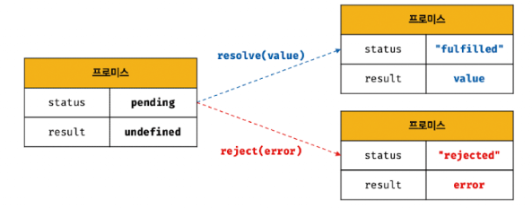

## 들어가며

자바스크립트는 싱글 스레드로 동작하며, 한 작업이 끝날 때까지 다른 작업을 처리하지 않는다. 그러나 브라우저 환경에서는 이벤트 루프를 사용하여 비동기 작업을 효율적으로 처리하고, 이로 인해 웹 애플리케이션의 성능과 사용자 경험을 향상시킨다. 이를 위해 콜백(callback) 함수 패턴을 사용하고, ES6부터는 프로미스(promise), `async/await`와 같은 패턴을 도입해 사용하고 있다.

### 비동기를 위한 프로미스 살펴보기

#### 프로미스란?

`fetch`나 다른 프로미스를 반환하는 비동기 함수들은 `Promise` 객체를 반환한다. 프로미스는 비동기 처리 상태와 처리 결과를 관리하는 객체이다. 이 `Promise` 객체는 세 가지 상태 중 하나를 가진다: `pending`, `fulfilled`, 또는 `rejected` 상태이다. 프로미스를 생성하려면 `new Promise()`와 같이 생성할 수 있다.

- **`pending`**: (초기 상태) 비동기 처리가 아직 수행되지 않은 상태이며, 프로미스가 생성된 직후 기본 상태이다.
- **`fulfilled`**(settled): 비동기 처리가 성공적으로 수행된 상태로, `resolve` 함수를 호출해 프로미스를 `fulfilled` 상태로 변경한다.
- **`rejected`**(settled): 비동기 처리가 실패한 상태로, `reject` 함수를 호출해 프로미스를 `rejected` 상태로 변경한다.

  

  _모던 자바스크립트 DeepDive 851p 그림 45-1, 프로미스의 상태_

### 프로미스의 후속 처리 메서드

프로미스의 비동기 처리 상태가 변화하면 이에 따른 후속 처리를 해야 한다. 이를 위해 프로미스는 후속 메서드 `then`, `catch`, `finally`를 제공한다. 프로미스의 비동기 처리 상태가 변화하면 후속 처리 메서드에 인수로 전달한 콜백 함수가 선택적으로 호출된다. 이때, 후속 처리 메서드의 콜백 함수에 프로미스의 처리 결과가 인수로 전달된다.

모든 후속 처리 메서드는 프로미스를 반환하며, 비동기로 동작한다. 참고로, 프로미스의 후속 처리 메서드도 비동기로 동작하기에 아래 예제의 출력 순서가 1 - 2 - 3일 것 같지만 실제로는 2 - 3 - 1이다. 프로미스의 후속 처리 메서드의 콜백 함수는 태스크 큐가 아니라 마이크로태스크 큐에 저장되는데, 이는 태스크 큐보다 우선순위가 높다. 따라서 콜 스택이 비면 이벤트 루프는 먼저 마이크로태스크 큐에서 대기하고 있는 함수를 가져와 실행하고, 이후 마이크로태스크 큐가 비면 그제서야 태스크 큐에서 대기하고 있는 함수를 가져와 실행한다.

```javascript
setTimeout(() => console.log(1), 0);

Promise.resolve()
  .then(() => console.log(2))
  .then(() => console.log(3));
```

#### `Promise.prototype.then`

`then` 메서드는 두 개의 콜백 함수를 인수로 전달받는다.

- 첫 번째 콜백 함수는 프로미스가 `fulfilled` 상태(`resolve` 함수가 호출된 상태)가 되면 호출된다. 이때 콜백 함수는 프로미스의 비동기 처리 결과를 인수로 전달받는다.
- 두 번째 콜백 함수는 프로미스가 `rejected` 상태(`reject` 함수가 호출된 상태)가 되면 호출된다. 이때 콜백 함수는 프로미스의 에러를 인수로 전달받는다.

즉, 첫 번째 콜백 함수는 비동기 처리가 **성공**했을 때 호출되는 성공 처리 콜백 함수이며, 두 번째 콜백 함수는 비동기 처리가 **실패**했을 때 호출되는 실패 처리 콜백 함수이다.

참고로 `then` 메서드는 언제나 프로미스를 반환한다. 만약 `then` 메서드의 콜백 함수가 프로미스를 반환하면 그 프로미스를 그대로 반환하고, 그렇지 않다면 그 값을 암묵적으로 `resolve` 또는 `reject`하여 프로미스를 생성해 반환한다.

#### `Promise.prototype.catch`

`catch` 메서드는 한 개의 콜백 함수를 인수로 전달받는다. `catch` 메서드의 콜백 함수는 프로미스가 `rejected` 상태인 경우에만 호출된다. `then` 메서드와 마찬가지로 언제나 프로미스를 반환한다.

#### `Promise.prototype.finally`

`finally` 메서드는 한 개의 콜백 함수를 인수로 전달받는다. `finally` 메서드의 콜백 함수는 프로미스의 성공 또는 실패 여부에 상관없이 무조건 한 번 호출된다. 마찬가지로 프로미스를 반환한다.

---

이렇게 프로미스의 후속 처리 메서드 세 가지를 살펴보았다.

그렇다면 위 세 가지의 메서드는 대략 아래와 같이 구현되어 있다고 추측할 수 있겠다. 아래 코드는 간단히 프로미스의 내부 동작을 추측하여 작성한 것이다. 이 코드는 실제 브라우저나 Node.js 환경에서 동작하지 않고, 실제로는 훨씬 더 복잡한 구현이 필요하다.

```javascript
class MyPromise {
  constructor(executor) {
    this.state = "pending"; // 프로미스의 상태를 나타내는 속성
    this.value = undefined; // 비동기 작업이 완료되면 결과 값을 저장할 속성
    this.error = undefined; // 에러가 발생했을 경우 에러 정보를 저장할 속성

    // 비동기 작업이 시작될 때 실행되는 함수
    const resolve = value => {
      if (this.state === "pending") {
        this.state = "fulfilled"; // 작업이 성공적으로 완료됨
        this.value = value; // 결과 값을 저장
      }
    };

    // 비동기 작업이 실패했을 때 실행되는 함수
    const reject = error => {
      if (this.state === "pending") {
        this.state = "rejected"; // 작업이 실패함
        this.error = error; // 에러 정보 저장
      }
    };

    // 프로미스 생성자 함수가 호출되면 executor 함수를 실행
    try {
      executor(resolve, reject);
    } catch (error) {
      reject(error); // executor 함수 실행 중 에러 발생 시 프로미스를 실패 상태로 변경
    }
  }

  // then 메서드: 성공한 경우에 실행할 콜백 함수 등록
  then(onFulfilled) {
    if (this.state === "fulfilled") {
      onFulfilled(this.value); // 작업이 성공한 경우 콜백 함수 실행
    }
    // 여기서 프로미스 체이닝을 고려하여 새로운 프로미스를 반환한다.
    // 이 부분은 간소화된 예시이므로 생략
  }

  // catch 메서드: 실패한 경우에 실행할 콜백 함수 등록
  catch(onRejected) {
    if (this.state === "rejected") {
      onRejected(this.error); // 작업이 실패한 경우 콜백 함수 실행
    }
    // 여기서도 새로운 프로미스를 반환한다.
    // 이 부분은 간소화된 예시이므로 생략
  }

  // finally 메서드: 성공 또는 실패 여부와 관계없이 항상 실행할 콜백 함수 등록
  finally(onFinally) {
    // 여기에서는 성공 또는 실패 여부와 관계없이 항상 콜백 함수 실행
    onFinally();
    // 여기서도 새로운 프로미스를 반환한다.
    // 이 부분은 간소화된 예시이므로 생략
  }
}
```

### `async/await`에 대하여

#### 제너레이터란?

ES6부터 도입된 제너레이터(generator)는 코드 블록의 실행을 일시 중지했다가 필요한 시점에 재개할 수 있는 특수한 함수이다.

제너레이터와 일반 함수의 차이는 다음과 같다.

(아래 내용은 모던 자바스크립트 46장, 제너레이터와 `async/await`에서 발췌)

1. **제너레이터 함수는 함수 호출자에게 함수 실행의 제어권을 양도할 수 있다.**

   일반 함수를 호출하면 제어권이 함수에게 넘어가고 함수 코드를 일괄 실행하게 된다. 즉, 함수 호출자(caller)는 함수를 호출한 이후 함수 실행을 제어할 수 없다. 그러나 제너레이터 함수는 함수 실행을 함수 호출자가 제어할 수 있다. 다시 말해, 함수 호출자가 함수 실행을 일시 중지시키거나 재개시킬 수 있다. 이는 함수의 제어권을 함수가 독점하는 것이 아니라 함수 호출자에게 양도할 수 있다는 것을 의미한다.

2. **제너레이터 함수는 함수 호출자와 함수의 상태를 주고받을 수 있다.**

   일반 함수를 호출하면 매개변수를 통해 함수 외부에서 값을 주입받고 함수 코드를 일괄 실행하여 결과값을 함수 외부로 반환한다. 즉, 함수가 실행되고 있는 동안에는 함수 외부에서 함수 내부로 값을 전달하여 함수의 상태를 변경할 수 없다. 그러나 제너레이터 함수는 함수 호출자와 양방향으로 함수의 상태를 주고받을 수 있다. 다시 말해, 제너레이터 함수는 함수 호출자에게 상태를 전달할 수 있고 함수 호출자로부터 상태를 전달받을 수도 있다.

3. **제너레이터 함수를 호출하면 제너레이터 객체를 반환한다.**

   일반 함수를 호출하면 함수 코드를 일괄 실행하고 값을 반환한다. 제너레이터 함수를 호출하면 함수 코드를 실행하는 것이 아니라 이터러블이면서 동시에 이터레이터인 제너레이터 객체를 반환한다.

잠깐 제너레이터 함수의 특징에 대해 알아보았다.

눈치챘겠지만, `async/await`를 이해하기 위해서는 제너레이터의 특징인 함수 실행의 제어권 양도 개념과 동기적인 흐름 제어 개념을 인지하고 있어야 하기 때문에 잠깐 언급하였다. 참고로 제너레이터는 현재 실행 중인 함수에서 제너레이터 객체를 만든 후, 제너레이터의 `next()`를 호출하면 제너레이터로 제어권을 넘기고 제너레이터는 본인의 역할을 수행하다가 `yield`를 실행하면 다시 제어권을 넘겨준 함수로 제어권을 양보하는 방식으로 동작한다. `yield`문과 `await` 문은 실행을 일시 중지하고 값을 반환한다는 점에서 유사성을 가지고 있다. 제너레이터의 자세한 동작 방식은 다음에 다루겠다. 일단 몇 가지 키워드로 함수를 호출한 쪽과 호출당한 쪽이 제어권(함수를 실행할 수 있는 권리 정도)을 주고받을 수 있다는 것이 제너레이터의 주요 개념이고, `async/await`는 프로미스와 제너레이터를 합친 일종의 **Syntax sugar**임을 알아두자.

### 프로미스 기반으로 동작하는 `async/await`

프로미스를 사용하면, 콜백 함수보다 함수의 깊이를 깊지 않게 관리할 수 있지만 여전히 `then`/`catch`/`finally`와 같은 후속 처리 메서드에 콜백 함수를 전달해서 비동기 처리 결과를 후속 처리해줘야 한다.

ES8부터 도입된 `async/await`는 그럴 필요 없이 마치 동기 처리처럼 프로미스를 사용할 수 있는 방식이다. 프로미스의 후속 처리 메서드 없이도 마치 동기 처리처럼 프로미스가 처리 결과를 반환하도록 구현할 수 있다.

이제 본격적으로 살펴보자.

`async/await`의 핵심적인 작동 방식은 `Promise`와 `generator`에 기반하고 있다.

- **`async` 함수**: `async` 키워드로 정의된 함수는 항상 프로미스를 반환한다. 만약 이 함수가 명시적으로 프로미스를 반환하지 않더라도 `async` 함수는 암묵적으로 반환값을 `resolve`하는 프로미스를 반환한다. 즉, 반환값은 `Promise.resolve()`로 감싸져 반환된다. 같은 맥락에서 클래스의 `constructor` 메서드는 `async` 메서드가 될 수 없는데, 클래스의 `constructor` 메서드는 인스턴스를 반환해야 하지만 `async` 함수는 언제나 프로미스를 반환해야 하기 때문이다.

  ```javascript
  async function exampleAsyncFunction() {
    return 42; // 이 값은 Promise.resolve(42)로 래핑된다.
  }

  exampleAsyncFunction().then(result => {
    console.log(result); // 42
  });
  ```

- **`await` 키워드**: `await` 키워드는 반드시 `async` 함수 내에서만 사용 가능하며, 프로미스를 받아 해당 프로미스가 **settled**(`fulfilled` 또는 `rejected`) 상태가 될 때까지 함수의 실행을 일시 중단한다. `await` 키워드가 사용된 위치에서 함수 실행이 일시 중단되는 것이며, `await` 키워드는 반드시 프로미스 앞에서 사용해야 한다.

  ```javascript
  async function fetchData() {
    try {
      const result = await fetch("https://api.example.com/data");
      const data = await result.json();
      console.log("잠시 중단되는 위치");
      return data;
    } catch (error) {
      console.error(error);
    }
  }
  ```

JavaScript 엔진은 `async` 함수 내부에서 `await` 키워드를 만나면, 반환되어야 하는 프로미스의 상태가 **settled**가 되기 전까지 호출한 쪽에 제어권을 넘겨주도록 설계되어 있다. 프로미스가 **settled** 상태가 되면, `await` 다음의 코드가 실행될 수 있게 제어권을 다시 가져온다. 즉, `await` 키워드는 JavaScript 엔진에게 해당 비동기 작업(주로 프로미스를 반환하는 함수)의 결과를 기다려야 한다는 것을 알려주고, 그동안 해당 `async` 함수의 실행을 일시 중단하고, 함수 밖의 다른 코드를 계속 실행할 수 있게 한다.

### 단계별 시뮬레이션

이해 강화를 위해 여러 상황을 가정해 생각해보자.

#### 💡 `fetch`와 같은 네트워크 요청일 때

`fetch`와 같은 네트워크 요청을 수행할 때 어떤 단계가 있는지 살펴보자.

1. **네트워크 요청 시작 및 제어권 이동**: `fetch`와 같은 함수는 네트워크 요청을 시작하고, 바로 프로미스 객체를 반환한다. 이 프로미스는 네트워크 요청의 완료를 나타내지는 않는다. 대신 요청이 시작되었음을 나타낸다. 프로미스는 `pending` 상태이다.
2. **네트워크 요청 처리**: 이 요청은 JavaScript 엔진 외부의 웹 API(브라우저 환경의 경우)에서 처리된다. JavaScript는 이를 기다리지 않고 다른 코드를 계속 실행한다.
3. **비동기 요청 완료**: 요청이 성공적으로 완료되거나 오류가 발생하면(네트워크 응답이 도착하면), 그에 따른 콜백(예: `fetch`의 경우 `.then()` 또는 `.catch()` 내의 함수)이 마이크로태스크 큐(Microtask Queue)나 태스크 큐(Task Queue)에 추가된다. 이때의 상태는 프로미스의 `resolve` 또는 `reject` 상태이다.
4. **제어권 반환**: 호출 스택이 비어 있으면 이벤트 루프는 태스크 큐의 이 작업을 가져와 호출 스택으로 넣는다. 만약 이 프로미스가 `await` 키워드 뒤에 위치해 있으면, 해당 프로미스가 **settled** 상태가 되면서 `await` 부분 다음 코드가 실행된다.

정리하면, 프로미스가 **settled** 상태가 되면 웹 API가 이를 태스크 큐에 추가한다. 이벤트 루프는 호출 스택이 비었을 때 이 작업을 가져와 실행하고, 만약 `await`가 사용되었다면 해당 `async` 함수에서 `await` 키워드 이후의 나머지 부분이 실행된다. 따라서, `await`를 사용할 때 JavaScript는 해당 작업이 완료될 때까지 기다리는 것이 아니라, 웹 API에서 해당 작업을 계속 진행하게 하고, 그 결과를 나중에 처리하게 되는 것이다.

#### 💡 브라우저 구조에 집중해 생각해보기

**JavaScript 엔진 내부에서의 동작**

- `async` 함수가 호출될 때, 이 함수는 특별한 종류의 객체인 제너레이터와 유사한 내부 상태를 가진다.
- 함수 내에서 `await` 키워드를 만나면, 현재 함수의 실행(`async` 함수)을 일시 중단하고 제어권을 호출자에게 반환한다. 이때, 함수의 내부 상태와 함께 현재 위치(어디서 일시 중단되었는지)도 저장된다.

예제 하나를 더 보자.

```javascript
async function fetchData() {
  console.log("Fetching data...");

  // 여기에서 fetchData 함수의 실행이 일시 중단된다.
  let data = await someAsyncFunction(); // 여기

  console.log("Data fetched:", data);
  console.log("무관한 코드");
}

console.log("Start");

fetchData();

console.log("End");
```

`someAsyncFunction`가 프로미스를 반환하는 어떤 `async` 함수라고 가정하자.

참고로, 비동기 함수인지 아닌지를 결정하는 것은 함수의 내부 로직과 그 함수가 어떤 환경에서 동작하는지에 따라 달라진다. 예를 들어, `setTimeout`이나 `XMLHttpRequest`와 같은 웹 API 함수는 브라우저 환경에서 제공되며, 그것들 자체는 JavaScript 언어의 일부가 아니다. 하지만 JavaScript 실행 환경(예: 브라우저, Node.js)은 이러한 함수들을 인식하고 적절히 비동기로 인식하고 처리한다. 따라서, 함수가 비동기로 동작하는지 아닌지는 그 함수의 정의와 실행 환경에 따라 결정된다고 가정할 수 있다.

`fetchData` 함수는 `await` 키워드가 있는 줄에서 일시적으로 실행이 중단된다. 언제까지? `someAsyncFunction`에서 반환된 프로미스가 **settled** 상태가 될 때까지.

예상되는 출력 결과는 아래와 같다.

```
Start
Fetching data...
End
(여기에서 someAsyncFunction이 완료될 때까지 기다림)
Data fetched: ...(data의 내용)...
무관한 코드
```

`await` 키워드는 그 다음에 오는 프로미스가 **settled**(즉, 완료된) 상태가 될 때까지 해당 `async` 함수 내의 실행을 일시 중단시켜주기 때문에, `fetchData` 함수 내에서만 실행이 일시 중단된다. 그리고는 제어권이 함수를 호출한 맥락에 넘어가 `fetchData` 호출 이후 코드인 `console.log("End");`가 즉시 실행된다.

프로미스가 **settled** 상태가 되면, 이벤트 루프는 일시 중단된 `async` 함수의 실행을 재개한다. 함수는 중단된 지점에서부터 계속해서 실행된다.

만약 `await` 뒤의 프로미스가 `rejected` 상태가 되면, 해당 에러는 `async` 함수 내부에서 발생한 것처럼 취급되며 `catch` 블록으로 처리할 수 있다.

### 실행 흐름 예측해보기

마지막으로, 코드의 실행 흐름을 예측하는 예제 두 개를 살펴보고 마치겠다.

#### 예제 1

다음 코드의 실행 흐름을 예측해보자.

```javascript
async function longAsyncFunction() {
  console.log("Start");

  let data1 = await firstAsyncFunction();
  console.log(data1);

  console.log("Middle");

  let data2 = await secondAsyncFunction();
  console.log(data2);

  console.log("End");
}

longAsyncFunction();
```

**📌 정답**

1. `longAsyncFunction`이 호출된다.
2. `console.log('Start');`가 먼저 실행된다.
3. `firstAsyncFunction`이 호출되고, 해당 함수가 완료될 때까지 `longAsyncFunction` 내의 코드 실행이 일시 중단된다.
4. `firstAsyncFunction`의 프로미스가 **settled** 상태가 되면 그 반환값이 `data1` 변수에 할당된다.
5. `console.log(data1);`이 실행되어 `data1`의 값이 출력된다.
6. `console.log('Middle');`이 실행되어 `"Middle"`이 출력된다.
7. `secondAsyncFunction`이 호출되고, 해당 함수가 완료될 때까지 다시 `longAsyncFunction` 내의 코드 실행이 일시 중단된다.
8. `secondAsyncFunction`의 프로미스가 **settled** 상태가 되면 그 반환값이 `data2` 변수에 할당된다.
9. `console.log(data2);`가 실행되어 `data2`의 값이 출력된다.
10. 마지막으로 `console.log('End');`가 실행되어 `"End"`가 출력된다.

#### 예제 2

다음 코드의 실행 흐름을 예측해보자.

```javascript
async function asyncFunction() {
  console.log("1. Start of async function");
  await new Promise(resolve => setTimeout(resolve, 1000)); // 잠시 중단
  console.log("3. After waiting in async function");
}

console.log("0. Before calling async function");
asyncFunction();
console.log("2. After calling async function");

for (let i = 0; i < 1e7; i++) {} // 시간 소비를 위한 단순한 반복문
console.log("4. After loop");
```

**📌 정답**

1. `"0. Before calling async function"`이 출력된다.
2. `asyncFunction` 함수를 호출한다.
3. `"1. Start of async function"`이 출력된다.
4. `setTimeout`의 콜백이 태스크 큐에 추가되며, 약 1초 후에 실행될 것이다.
5. `await` 때문에 `asyncFunction`의 나머지 부분은 대기 상태로 들어간다.
6. `"2. After calling async function"`이 출력된다.
7. 반복문이 실행된다.
8. `"4. After loop"`가 출력된다.
9. 이 시점에서 약 1초가 경과하므로 `setTimeout`의 콜백이 실행될 준비가 된다.
10. 이벤트 루프는 호출 스택이 비어 있을 때 태스크 큐에서 작업을 가져와 호출 스택에 넣는다. 따라서 `setTimeout`의 콜백이 호출 스택에 넣어진다.
11. `setTimeout`의 콜백이 실행되면서 해당 프로미스는 `resolved` 상태가 된다.
12. 이제 `await` 다음의 코드, 즉 `"3. After waiting in async function"`이 출력된다.

### 마치며

지난 글부터(콜백 함수) 자바스크립트에서 비동기를 처리하는 패턴이 등장하게 된 이유와 콜백, 프로미스, `async/await` 순으로 변형된 당위성에 대해 많이 고민해보았다. 직면한 문제를 처리하는 데는 다양한 패턴이 있고, 같은 패턴이라도 더 사용하기 유용하게 진화시킬 수 있는 것 같다. 이전에 만들어둔 것을 어떻게 사용할 것인가, 혹은 어떻게 고칠 것인가에 대해 고민하는 습관을 잘 들여야겠다는 생각이 들었다.

### 참고자료

- [모던 자바스크립트 DeepDive 45장, 프로미스](https://m.yes24.com/Goods/Detail/92742567)
- [모던 자바스크립트 DeepDive 46장, 제너레이터와 async/await](https://m.yes24.com/Goods/Detail/92742567)
- [JavaScript.info: async/await](https://ko.javascript.info/async-await)
