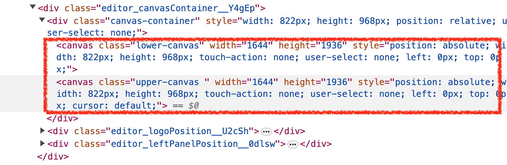
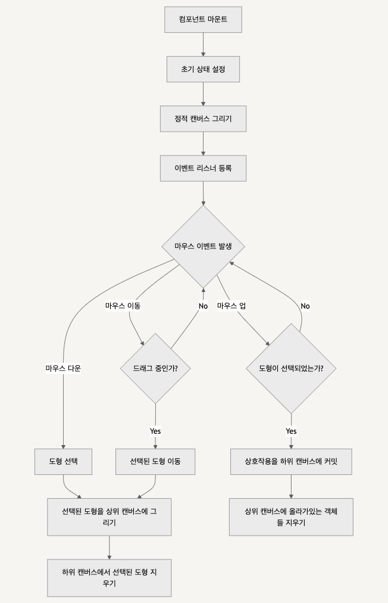
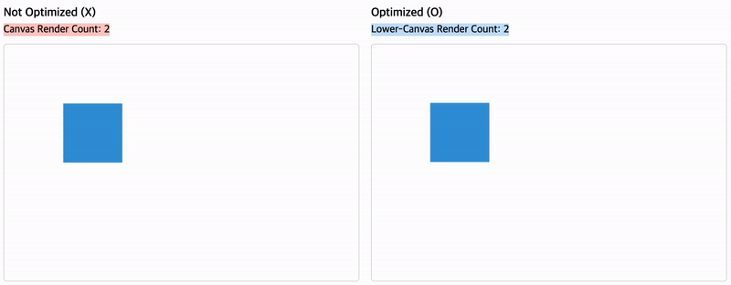

## Fabric.js의 간단한 구현 및 최적화 전략

Fabric.js 라이브러리를 간단히 살펴본 결과, 주요 로직은 `Canvas.ts`와 `SelectableCanvas.ts`에 있었다. 간단히 흐름 위주로 살펴보자.

### 코드 살펴보기

- [Canvas.ts](https://github.com/fabricjs/fabric.js/blob/master/src/canvas/Canvas.ts)
  - Canvas 클래스를 중심으로 구성된 TypeScript 파일로, 이 클래스는 후술할 SelectableCanvas를 확장하여 다양한 이벤트 처리와 드래그 앤 드롭, 텍스트 편집 관리 등을 지원하고 있다. **캔버스 요소에 대한 유저와의 상호작용**(mousedown, mouseup, mousemove, touchstart, touchend, touchmove 등)을 관리하기 위해 설계되었고, 그와 관련된 내용이 담겨있다.
- [SelectableCanvas.ts](https://github.com/fabricjs/fabric.js/blob/master/src/canvas/SelectableCanvas.ts)
  - SelectableCanvas 클래스에서는 Fabric.js가 **두 개의 canvas 태그를 겹쳐서 어떻게 렌더링 최적화 작업을 진행했는지에 대한 로직**이 담겨있다. (변화가 적거나 없는 콘텐츠 렌더링용 캔버스를 staticCanvas, 사용자 상호작용에 따라 변경 중인 콘텐츠가 담긴 캔버스를 dynamicCanvas라고 하겠다.)

중요한 부분이 많지만, 핵심 메소드 renderAll를 보자. renderAll 메소드는 캔버스 렌더링 시 호출되고, 다음과 같은 단계를 거쳐 최적화 작업을 진행한다.

```typescript
 /**
 * Renders both the top canvas and the secondary container canvas.
 */
renderAll() {
  this.cancelRequestedRender(); // 렌더링 작업을 취소하는 작업으로 추정, 불필요한 렌더링 호출을 방지
  if (this.destroyed) {
    return; // 캔버스가 이미 파괴된 상태라면 렌더링을 수행하지 않고 함수를 종료
  }
  // 방어로직들
  if (this.contextTopDirty && !this._groupSelector && !this.isDrawingMode) {
    this.clearContext(this.contextTop);
    this.contextTopDirty = false;
  }
  // 컨텍스트 손실 상황에서 복구를 위한 방어로직
  if (this.hasLostContext) {
    this.renderTopLayer(this.contextTop);
    this.hasLostContext = false;
  }
  !this._objectsToRender &&
    (this._objectsToRender = this._chooseObjectsToRender()); // 렌더가 필요한 객체들만 선별
  this.renderCanvas(this.getContext(), this._objectsToRender); // 선택된 객체들(_objectsToRender)을 실제로 캔버스에 렌더링
}
```

- \_objectsToRender를 이용해 동적/정적 object들을 구분해 다른 레이어에 렌더하는 것, 이것이 바로 최적화 핵심이라고 생각한다. 실제 fabric.js가 렌더된 걸 보면 fabric.canvas를 하나만 선언해도 기본적으로 lower-canvas, upper-canvas 두 겹의 캔버스가 렌더뢴다. upper-canvas가 동적 상호작용을 처리하고, lower-canvas가 정적 요소를 렌더링하는 데 사용되는 방식으로 해석할 수 있겠다.

  

### 실제로 확인해보자

fabric.js 내부의 example ["Opacity on mouse move"](http://fabricjs.com/opacity_mouse_move)는 사용자가 마우스를 움직일 때 객체의 투명도가 변경되는 상호작용을 보여주고 있다. 아래는 정상동작, lower-canvas만 제거한 경우, upper-canvas를 제거한 경우에 어떤 변화가 있는지를 녹화한 영상들인데, 보면 upper-canvas와 lower-canvas이 어떤 역할을 하고 있는지 감이 좀 올거라 생각한다.

- 정상 동작

  - 정상 동작하는 상태

    <video controls>
      <source src="./assets/normal.mov" type="video/mp4">
    </video>

  * Lower-canvas (staticCanvas) 제거
    <video src="./assets/remove-lower.mov">

    - 렌더는 이뤄지나, 에셋이 제대로 upper-canvas에 커밋되지 않음

    * lower-canvas에 배경 이미지가 그려져 있으므로, 이 캔버스를 지우면 화면에서 배경 이미지가 사라집니다. 즉, 배경 이미지가 전혀 보이지 않게 됨

  * Upper-canvas (dynamicCanvas) 제거
    <video src="./assets/remove-upper.mov">

    - 사용자 상호작용이 이뤄지지 않음

    * upper-canvas는 동적 상호작용(투명도 변경)을 담당하므로, 이 캔버스를 지우면 배경 이미지는 그대로 보이지만 마우스 움직임에 따른 투명도 변경이 일어나지 않는다. 즉, 이미지의 상태 변화나 마우스 이벤트에 응답하지 않게 된다.

* 결론은 간단하다! “상호작용에 따른 렌더링 부하는 upper-canvas에만 한정시켜 lower-canvas의 리소스 사용을 최소화한다. 상호작용이 필요 없는 정적 요소는 한 번만 그려지고 계속 재사용되므로 전체적인 렌더링 효율이 높아진다”의 개념이 계속 사용되고 있다.

### 최적화 원리 정리

- **Lower-Canvas (staticCanvas)는** 기본적으로 모든 그래픽 객체들이 처음에 그려지는 곳. 이곳에 그려진 내용은 대부분 정적이며, 사용자의 상호작용이 없는 한 변경되지 않는다. 반면 **Upper-Canvas (DynamicCanvas)**에는 사용자의 입력과 직접적으로 상호작용하는 동적 객체들을 처리한다. 예를 들어, 객체를 드래그하는 동안 그 객체의 이미지는 upper-canvas에 그려지며, 사용자가 조작을 마치면 그 결과가 lower-canvas로 "확정"되어 반영된다. upper-canvas는 주로 마우스 이벤트를 처리하고, 이벤트에 따른 객체의 임시 변화들을 렌더링하는데 사용된다.

* 왜 레이어를 분리했을까? 바로 “복잡한 것들을 여러 번 그리고 싶지 않다”는 이유 때문일 것으로 추측한다. **만약 변경이 적은 여러 객체 + 복잡한 배경이 있는데, 상호작용이 많은 객체가 몇 개** 있다면 상호작용이 많은 객체 하나를 위해서 모두 다시 그려야하는 상황이 발생한다. 그렇기 때문에 레이어를 두 개 둡니다. 일단 정적 레이어에 모두 그린 다음, 특성 객체들에서 상호작용이 감지되면 투명하게 유지되고 있던 동적 레이어에 해당 객체들을 옮겨 그려 겹쳐보이게 한다. (아마 정적 레이어에는 해당 객체들을 제외한 나머지것들을 다시 한 번 더 렌더할 것 같긴 하고, 또한 fabric.js에서는 이 객체들이 \_objectsToRender로 관리되고 있는 것 같음) 동적 객체에서 타겟 객체들만 신나게 다시 그린 후, 사용자 상호작용이 끝났다고 판별되면 마지막 변경사항을 정적 레이어에 반영한다. (깃 commit의 개념과 유사할듯?)

## 간단히 클로닝 해보자

어쨌든 객체 기반으로 추상화된 fabric.js도 결국 canvas로 이루어졌을테니, 가장 마이크로한 버전의 fabric.js를 직접 구현해보자. 몇 가지 도형에 대해 대표 기능인 객체 크기 조정(resizing)과 회전(rotate) 정도 구현해보고, 가장 대표적인 최적화 정도만 클론하도록 한다.

### Overview - demo

[🔗 클론 사이트 바로가기](https://fabric-js-example.vercel.app/)

### 동작 flowchart

  

### Resizing, Rotating with canvas

[🔗 Resizing, Rotating 구현데모](https://fabric-js-example.vercel.app/canvas)

### MultiLayer with canvas

[🔗 MultiLayer (static, dynamic) Canvas 최적화 구현데모](https://fabric-js-example.vercel.app/multi-layer-canvas)



- 위 gif에 나타난 render count는 static에 해당하는 캔버스가 어느 정도의 빈도로 렌더되었는가를 나타낸다. 사실 위 gif와 같은 경우는 배경이 그저 흰색이므로 성능 차이가 유의미하지 않지만 (어차피 upper-canvas에서는 왼쪽 1장짜리 캔버스와 동일하게 렌더되므로 유의미하지 않고, 오히려 복원과 커밋을 위한 렌더 횟수가 더 필요할 수도 있음) 만약 복잡한 경로를 가진 svg나, 렌더된 객체 수가 많은 경우 왼쪽과 오른쪽의 성능 차이가 유의미해질 것으로 예측한다.
