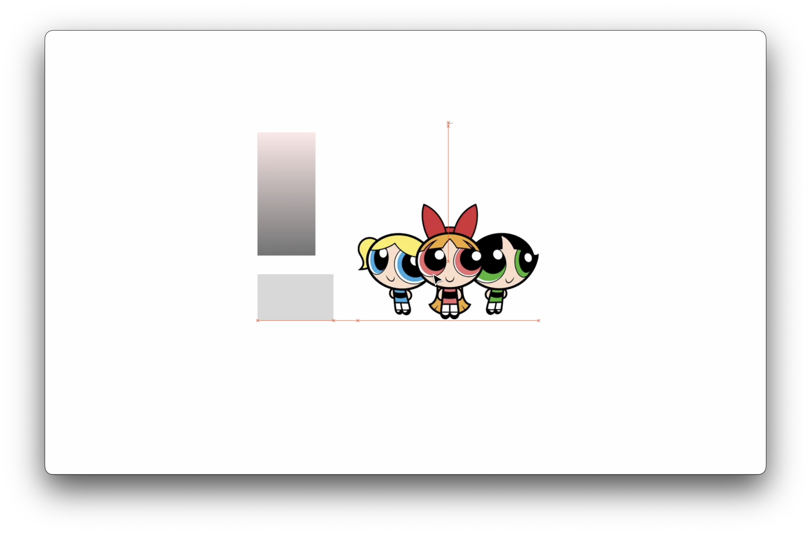
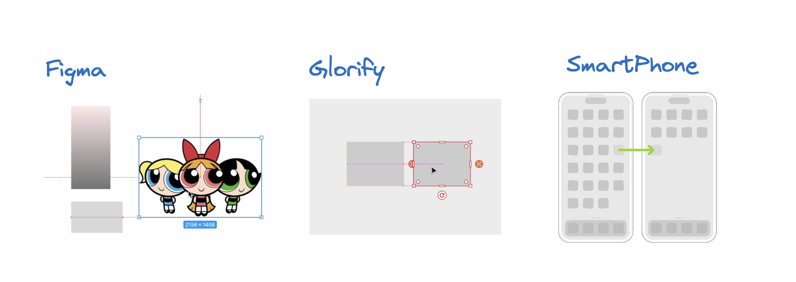
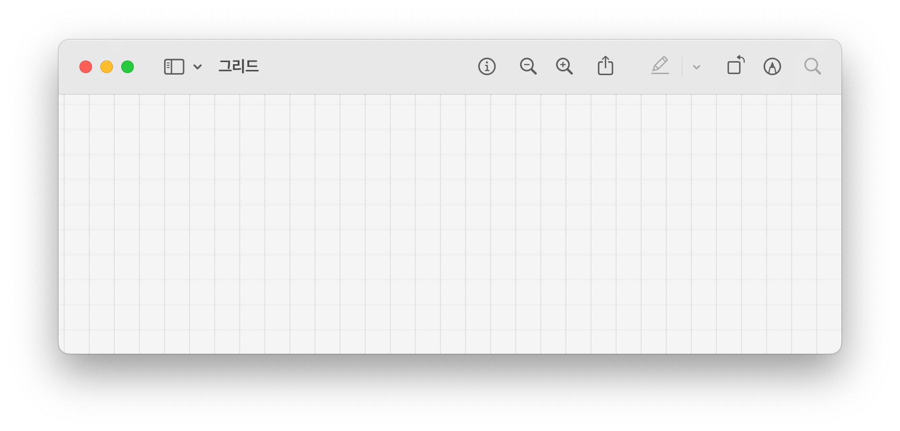
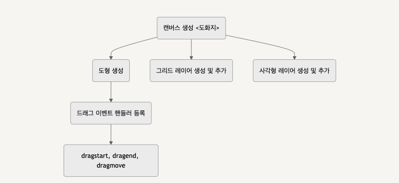

## 들어가며



- 에디터에서 객체를 다룰 때 유용한 기능 중 하나인 Snap에 대해 이야기해보려고 한다. Snap 기능은 객체를 정렬하고 배치할 때 큰 도움이 되는데, 어떤 상황에서 필요하고 어떻게 구현할 수 있을지 살펴보자.

## Snap, 왜 필요할까?

- 객체를 원하는 위치로 배치할 수 있다는 것은 자유도가 보장되어 있다는 점에서 굉장한 장점이 있다.

* 그러나 때로는 객체를 정확히 원하는 위치에 배치하는 것이 오히려 어려울 수도 있다는 점이 있는데, 예를 들어, 그리드에 맞춰 객체를 정렬하거나 다른 객체와의 간격을 일정하게 유지하게 하려면 세밀하게 위치를 조정해줘야 한다.
* 이런 상황에서 Snap 기능은 유용하게 사용될 수 있다.

* 피그마를 이리저리 사용하다보면 마치 자석처럼 객체가 딱 붙거나, 혹은 보이지 않는 그리드에 객체가 딱 들어맞는 느낌을 받아본 적이 있을 것이다. 바로 Snap 기능으로, 이 기능은 객체를 이동할 때 특정 위치에 자동으로 정렬해주는 역할을 해준다.
* 리드에 맞춰 객체를 정렬하거나, 다른 객체와의 간격을 일정하게 유지할 수 있다. 사용자는 객체를 보다 쉽게 정렬하고 배치할 수 있으며, 시각적으로도 깔끔한 레이아웃을 만들 수 있다.

## 서비스에서의 Snaps

- 스냅 기능은 그래픽 디자인 툴에서 많이 제공되고 있는 기능이다.



- 에디터뿐만 아니라 스마트폰 홈 화면에서도 아이콘을 정렬할 때도 Snap 유사한 기능이 적용되고 있다. 아이콘을 옮기다 보면 자동으로 딱 맞는 위치로 이동하는 걸 쉽게 관찰할 수 있음.

## 어떻게 동작할까?

- (1) 그리드 시스템, (2) 좌표 계산, (3) 경계 검사 등의 개념을 사용해 동작하는 것으로 예측한다.

1. 그리드 시스템:

   먼저 그리드 시스템의 “그리드”는 객체를 정렬할 기준이 되는 가상의 선이나 점들의 집합을 말한다. Snap 기능은 객체를 특정 그리드에 맞추는 것을 목표로 하고, 그리드의 간격과 크기를 정의하여 객체의 위치를 그리드에 맞출 수 있다. 예를 들어, 10 픽셀 단위의 그리드를 사용한다면 객체의 위치는 (0, 0), (10, 0), (20, 0) 등의 좌표로 스냅된다.



2. 좌표 계산:

   다음으로는 좌표 계산인데, 객체의 현재 위치와 목표 위치 사이의 거리를 계산하여 Snap 여부를 판단하게 된다.

3. 경계 검사:

   마지막으로 경계 검사를 통해 객체가 Snap 영역 내에 있는지 확인한다. Snap 영역 내에 객체가 위치할 때만 Snap이 발생하도록 조건을 설정해서 필요한 부분에서만 기능을 제공할 수 있다.

## 간단히 구현해보기

### Overview



- **객체 생성 (view)**
- **스냅 가능한 가이드라인 계산 (calc)**
- **객체의 스냅포인트 계산 (calc)**
- **가이드라인 그리기 (view)**
- **가이드라인과 스냅포인트 매칭 (calc)**
- **이벤트 핸들러 등록 (event)**

### 객체 생성

- 스냅이 될, 그리고 스냅 계산의 대상이 될 객체들이 필요하겠지? 생성해준다.

* 예제
  ```tsx
  // 그저 사각형을 만드는 과정
  for (let i = 0; i < 5; i++) {
    layer.add(
      new Konva.Rect({
        name: "object", // 이후에 스냅 대상이 될 객체를 부를 식별자
        x: Math.random() * stage.width(),
        y: Math.random() * stage.height(),
        width: 50 + Math.random() * 50,
        height: 50 + Math.random() * 50,
        fill: Konva.Util.getRandomColor(),
        rotation: Math.random() * 360,
        draggable: true,
      })
    );
  }
  ```

### 스냅 가능한 가이드라인 계산

- 드래그할 때 다른 객체와 정렬하기 위해 가상의 가이드라인을 만든다. 현재 드래그 중인 객체를 제외한 나머지 객체들의 가장자리와 중앙선을 기준으로 가이드라인을 계산한다. 여기서 가이드라인이란, 객체가 스냅될 수 있는 가상의 선을 의미한다.

* 드래그 중인 객체가 스냅될 수 있는 모든 가이드라인(중심선, 다른 객체의 경계와 중심)을 계산, `dragmove` 이벤트 핸들러에서 드래그 중인 객체의 스냅 가능한 위치를 찾을 때 사용

* 예제

  ```tsx
  // 스냅의 기준이 될 가이드라인들 계산하자
  const getLineGuideStops = (skipShape) => { // 보통 나 자신을 넣음 (스킵)
    // 스테이지 경계와 스테이지 중심에 스냅
    let vertical = [0, stage.width() / 2, stage.width()]; // 수직 가이드라인
    let horizontal = [0, stage.height() / 2, stage.height()];  // 수평 가이드라인

    stage.find('.object').forEach((guideItem) => {
      if (guideItem.equals(skipShape) {
        return; // 스냅 계산에서 제외
      }
      const box = guideItem.getClientRect();
      // 모든 도형의 가장자리에 스냅 가능, 계산 대상에 넣어준다
      vertical.push([box.x, box.x + box.width, box.x + box.width / 2]);
      horizontal.push([box.y, box.y + box.height, box.y + box.height / 2]);
    });
    return {
      vertical: vertical.flat(),
      horizontal: horizontal.flat(),
    };
  };

  // 계산의 대상이 되는 경계값들을 넣어줌
  ```

### 객체의 스냅포인트 계산

- 특정 객체(node)의 스냅 포인트를 계산한다. 여기에는 객체의 왼쪽, 오른쪽, 상단, 하단 가장자리와 수평 및 수직 중심점이 포함된다.

* 예제

  ```tsx
  const getObjectSnappingEdges = node => {
    const box = node.getClientRect();
    const absPos = node.absolutePosition();

    return {
      vertical: [
        {
          guide: Math.round(box.x),
          offset: Math.round(absPos.x - box.x),
          snap: "start",
        },
        {
          guide: Math.round(box.x + box.width / 2),
          offset: Math.round(absPos.x - box.x - box.width / 2),
          snap: "center",
        },
        {
          guide: Math.round(box.x + box.width),
          offset: Math.round(absPos.x - box.x - box.width),
          snap: "end",
        },
      ],
      horizontal: [
        {
          guide: Math.round(box.y),
          offset: Math.round(absPos.y - box.y),
          snap: "start",
        },
        {
          guide: Math.round(box.y + box.height / 2),
          offset: Math.round(absPos.y - box.y - box.height / 2),
          snap: "center",
        },
        {
          guide: Math.round(box.y + box.height),
          offset: Math.round(absPos.y - box.y - box.height),
          snap: "end",
        },
      ],
    };
  };
  ```

### 가이드라인 그리기

- 드래그하는 동안 가이드라인을 화면에 그려서 객체가 어디에 맞춰질지 보여준다.

* 예제
  ```tsx
  // 가이드 받아서 그려준다
  const drawGuides = guides => {
    guides.forEach(lg => {
      if (lg.orientation === "H") {
        const line = new Konva.Line({
          points: [-6000, 0, 6000, 0],
          stroke: "rgb(0, 161, 255)",
          strokeWidth: 1,
          name: "guid-line",
          dash: [4, 6],
        });
        layer.add(line);
        line.absolutePosition({
          x: 0,
          y: lg.lineGuide,
        });
      } else if (lg.orientation === "V") {
        const line = new Konva.Line({
          points: [0, -6000, 0, 6000],
          stroke: "rgb(0, 161, 255)",
          strokeWidth: 1,
          name: "guid-line",
          dash: [4, 6],
        });
        layer.add(line);
        line.absolutePosition({
          x: lg.lineGuide,
          y: 0,
        });
      }
    });
  };
  ```

### 가이드라인과 스냅 포인트 매칭

- 스냅포인트와 가까운 가이드라인을 찾아서, 객체를 그 위치로 이동시킨다.

* 예제

  ```tsx
  // 모든 스냅 가능성 찾기
  const getGuides = (lineGuideStops, itemBounds) => {
    let resultV = [];
    let resultH = [];

    lineGuideStops.vertical.forEach(lineGuide => {
      itemBounds.vertical.forEach(itemBound => {
        const diff = Math.abs(lineGuide - itemBound.guide);
        // 가이드 라인과 오브젝트 스냅 지점 사이의 거리가 가까우면 스냅을 고려
        if (diff < GUIDELINE_OFFSET) {
          resultV.push({
            lineGuide: lineGuide,
            diff: diff,
            snap: itemBound.snap,
            offset: itemBound.offset,
          });
        }
      });
    });

    lineGuideStops.horizontal.forEach(lineGuide => {
      itemBounds.horizontal.forEach(itemBound => {
        const diff = Math.abs(lineGuide - itemBound.guide);
        if (diff < GUIDELINE_OFFSET) {
          resultH.push({
            lineGuide: lineGuide,
            diff: diff,
            snap: itemBound.snap,
            offset: itemBound.offset,
          });
        }
      });
    });

    let guides = [];

    // 가장 가까운 스냅 찾기
    const minV = resultV.sort((a, b) => a.diff - b.diff)[0];
    const minH = resultH.sort((a, b) => a.diff - b.diff)[0];
    if (minV) {
      guides.push({
        lineGuide: minV.lineGuide,
        offset: minV.offset,
        orientation: "V",
        snap: minV.snap,
      });
    }
    if (minH) {
      guides.push({
        lineGuide: minH.lineGuide,
        offset: minH.offset,
        orientation: "H",
        snap: minH.snap,
      });
    }
    return guides;
  };
  ```

### 이벤트 핸들러 등록

`dragmove`, `dragend` 이벤트를 통해 객체를 드래그할 때 스냅 기능을 적용한다.

- 예제

  - `dragmove` 이벤트 핸들러

    - 객체를 드래그하는 동안 스냅 가능한 가이드라인을 계산하고, 가이드라인을 화면에 그린다.

    ```tsx
    layer.on("dragmove", function (e) {
      // 화면에서 이전 모든 라인 지우기
      layer.find(".guid-line").forEach(l => l.destroy());

      // 가능한 스냅 라인 찾기
      const lineGuideStops = getLineGuideStops(e.target);
      // 현재 오브젝트의 스냅 지점 찾기
      const itemBounds = getObjectSnappingEdges(e.target);

      // 이제 현재 오브젝트를 어디에 스냅할 수 있는지 찾음
      const guides = getGuides(lineGuideStops, itemBounds);

      // 스냅이 없으면 아무 작업도 하지 않음
      if (!guides.length) {
        return;
      }

      drawGuides(guides);

      const absPos = e.target.absolutePosition();
      // 이제 오브젝트 위치를 강제로 지정함
      guides.forEach(lg => {
        switch (lg.orientation) {
          case "V": {
            absPos.x = lg.lineGuide + lg.offset;
            break;
          }
          case "H": {
            absPos.y = lg.lineGuide + lg.offset;
            break;
          }
        }
      });
      e.target.absolutePosition(absPos);
    });
    ```

  - `dragend` 이벤트 핸들러
    - 드래그가 끝나면 가이드라인을 화면에서 제거합니다.
    ```tsx
    layer.on("dragend", function (e) {
      // 화면에서 이전 모든 라인 지우기
      layer.find(".guid-line").forEach(l => l.destroy());
    });
    ```

https://codepen.io/lerrybe/pen/YzbejZw

## 고려사항

- 성능 고려사항:
  - 많은 객체를 대상으로 스냅을 적용하거나 복잡한 계산을 수행할 경우 성능 저하가 발생할 가능성
  - 필요한 경우 스냅 계산을 최적화하거나 객체의 수를 제한해야 한다. 예를 들어, 객체 수가 많을 때는 이진 탐색 알고리즘을 도입하거나 객체를 사전 필터링하여 계산을 줄일 수 있다.

### 또 다른 예제 (dragend 시 스냅시키는 예제)

https://codepen.io/lerrybe/pen/BaeZBVv

```tsx
rectangle.on("dragend", () => {
  rectangle.position({
    x: Math.round(rectangle.x() / blockSnapSize) * blockSnapSize,
    y: Math.round(rectangle.y() / blockSnapSize) * blockSnapSize,
  });
  stage.batchDraw();
  shadowRectangle.hide();
});
```

- dragend 시에 사각형의 위치를 그리드에 맞춰 조정한다.
  - 사각형의 x, y 좌표를 `blockSnapSize`로 나눈 후 반올림하여 그리드에 맞는 좌표를 계산
  - 계산된 좌표에 `blockSnapSize`를 곱해 그리드에 정확히 맞는 위치로 조정
