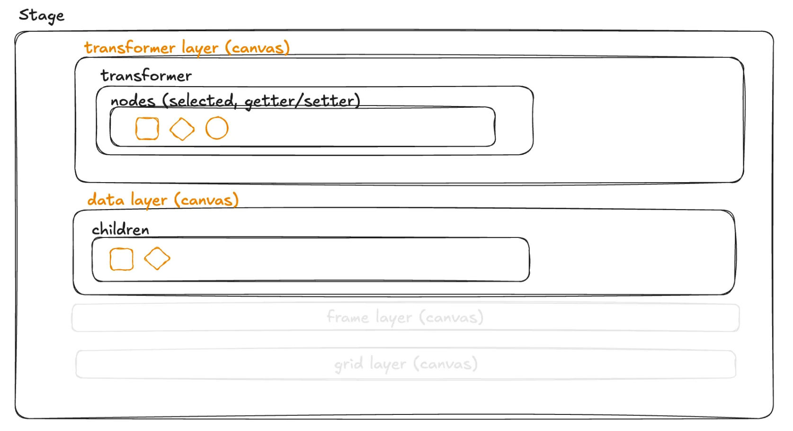

## 요약

### **M(V)C 적용**

- 실질적으로 뷰를 업데이트 하는 코드는 라이브러리에 위임

### Adaptor 구조

- 컴포넌트 단에서의 **외부 라이브러리에 대한 직접 참조**를 지양, 한 계층의 adaptor을 둠

### 사용 라이브러리

- https://konvajs.org/
- `Konva.js`의 기본 구조
  ```
                Stage
                |
         +------+------+
         |             |
       Layer         Layer
         |             |
   +-----+-----+     Shape
   |           |
  Group       Group
   |           |
   +       +---+---+
   |       |       |
  Shape   Group    Shape
           |
           +
           |
         Shape
  ```



- Data Layer → 실질적인 노드 정보들을 담고 있는 캔버스 레이어

  - Model을 직접 가지고 있는 친구, Layer Class를 가지고 있음
  - attribute(in konva), children
  - children 없는 노드들: circle 등… 단일 노드들!

- Transformer Layer

- Grid Layer (아직 없음)
  - 정렬 Grid 를 위한 것
  - snap 가이드라인
    http://seeyousoonduck.notion.site/

### 기조

- 컴포넌트에서 **에디터를 조작**하려면 `controller`를 통해서만 조작, 직접 Model에 접근하지 말자!

### 노드 조작 / 데이터 얻는 방법

1. setters
   - `node.setAttr(propertyName, value)`
   - `node.setAttrs({ propertyName: value })`
   - `node.width(value)`
2. getters
   - `node.width()`
   - `node.attr.width` (옵셔널 필요)

## 상세

### 전체 구조

- **Editor 클래스는 전체 시스템의 핵심**이며, `모델`, `컨트롤러`, `이벤트 핸들러`를 관리

### 모델 (Model)

- 다양한 모델 클래스들이 존재 (stage-model, history-model, select-box-model 등)
- 각 모델은 특정 기능이나 상태에 대한 데이터를 관리
- 예: stage-model은 캔버스의 크기, 배경색 등을 관리하고, history-model은 실행 취소/다시 실행 기능을 위한 상태를 관리
- model에서 상태를 가져오고 세팅하기 위한 getter, setter 존재

### 컨트롤러 (Controller)

- 각 컨트롤러는 **특정 기능**이나 **동작**을 담당
- 사용자 입력을 처리하고 모델을 업데이트하는 역할
- 예: history-redo-controller는 실행 취소 기능을, export-image-controller는 이미지 내보내기 기능을 처리
- **컴포넌트에서 이 컨트롤러를 이용해 canvas를 업데이트 하는 경우가 다수**

### 뷰 (View) 처리

- MVC 패턴의 별도 View 컴포넌트 대신, **Konva 라이브러리가 직접 캔버스 렌더링**을 담당
- 모델의 상태 변화가 **Konva 객체에 직접 반영되어 화면에 그려짐**

### 이벤트 핸들링

- 별도의 이벤트 핸들러 클래스들이 존재 (mousewheel-handler, dragstart-handler 등).
- 이 핸들러들은 사용자 입력을 처리하고, 적절한 컨트롤러나 모델을 호출
- Editor 클래스의 appendEventListener 메서드를 통해 이벤트 리스너가 등록됨

### 커스텀 이벤트 시스템

- addCustomEventListener와 emitCustomEvent 메서드를 통해 커스텀 이벤트를 관리
- 컴포넌트 ↔ 캔버스 간 통신을 가능하게 함

### 서비스 레이어

- ToolService 클래스가 도구 관련 로직을 캡슐화
- 이는 모델과 컨트롤러 사이의 중간 계층 역할을 함

### 확장성

- 새로운 기능을 추가할 때 새로운 모델, 컨트롤러, 이벤트 핸들러를 만들어 쉽게 통합할 수 있음

### 캡슐화

- Konva 라이브러리를 컴포넌트단/클래스에서 직접 참조하는 것을 제거
- 현재는 타입이나 오브젝트에 대해서만 캡슐화해서 아쉽지만, 후에 메소드단까지 명시적으로 캡슐화할 수 있다면 좋을 것

## undo, redo

- `action`을 **히스토리 배열에 기록**하고 (`undoHistory`, `redoHistory`)

- execute를 통해 되돌리기/다시실행을 실행

- `action` 종류

  - `change-node-action`
  - `create-node-action`
  - `delete-node-action`

- `actionRecordController` 호출부 (히스토리에 액션 기록 하는 방법)
- `actionRecordController` 선언부

  - 노드 ID를 키로 하고, 변경된 속성 정보를 값으로 가지는 맵을 생성
  - 노드에 대해 이전 상태와 현재 상태의 속성을 비교합니다.
  - diff 함수를 사용하여 두 노드의 attrs 속성 차이를 계산
  - 속성의 변경 여부를 확인하고, 변경되었거나 새로 추가된 속성을 diffMap에 기록
  - ChangeNodesAction 객체를 생성하여 변경된 내용을 히스토리 모델의 undo 히스토리에 추가
  - 커스텀 이벤트를 디스패치하여 다른 시스템이나 컴포넌트에 변경 사항을 알림

## 이벤트 리스너

- When: **canvas → component 동기화가 필요할 때** 이 친구를 호출해야 함.
  - `dispatchEvent`를 통해 이벤트 발생 (주로 controller쪽에서 dispatch)
  - 해당 이벤트가 발생했을 때 어떤 action을 걸어줄지를 리스너를 등록 (주로 component 쪽에서 listener 등록)
- 내부의 상태 변경을 다른 시스템, 컴포넌트에 알림으로써 반응하게 하기 위함
- 특정 상태가 변경되었을 때 관련 리스너가 해당 변화를 감지하고 반응하게 할 수 있음 (동기화를 위함)
- **해당 이벤트가 발생했을 때 호출되어야 할 콜백 함수들 (리스너)를 모두 호출 (controller/base.ts의 dispatchEvent)**
- 실제 일어나는 작업은 이벤트를 수신한 모듈들이 처리
- **과정**

  - `editor.ts` 내부에 이벤트 리스너 맵 존재 (이벤트들이 정의되어 있는 곳)
    ```tsx
    export type GraphicEditorCustomEventListeners = {
      [key in GraphicEditorCustomEvent]?: Array<GraphicEditorCustomEventHandler>;
    };
    ```
  - `use-graphic-editor-event-listeners` 훅 안에 `addCustomEventListener`, `removeCustomEventListener` 함수를 정의
