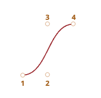

# 베지어 곡선(Bezier Curve)

## 레퍼런스

- https://ko.javascript.info/bezier-curve

## Overview

- **베지어 곡선**은 컴퓨터 그래픽스에서 널리 사용되는 곡선이며, CSS 애니메이션 등에서 **부드러운 곡선** 을 쉽게 그리거나 **애니메이션 타이밍** 을 조절할 때 자주 쓰입니다.
- **제어점(컨트롤 포인트)** 을 이용해 매끄러운 곡선을 생성하는 **수학적 모델**이 바로 베지어 곡선인데, 1960년대 자동차 회사 르노(Renault)에서 근무하던 피에르 베지어(Pierre Bézier)가 차체 디자인을 효율적으로 하기 위해 개발한 기법으로, 적은 수의 점(제어점)만으로도 복잡하고 유연한 곡선을 표현할 수 있어 현재까지도 다양한 분야에서 폭넓게 활용되고 있습니다.
- **조절점(control point)** 을 기준으로 곡선이 정의되며, 조절점의 개수에 따라 곡선의 차수가 달라집니다.

## 특징

1. **조절점이 반드시 곡선 위에 있지는 않음**
   - 곡선의 양 끝을 제외하곤, 조절점이 곡선 위를 ‘통과’하지 않아도 됩니다.
2. **곡선의 차수 = 조절점 개수 - 1**
   - 조절점 2개 → 1차(직선)
     
   - 조절점 3개 → 2차 곡선
     
   - 조절점 4개 → 3차 곡선
     
   - ... (재귀적으로 확장 가능)
3. 곡선은 늘 조절점의 컨벡스 헐(convex hull) 안에 위치

   - 컨벡스 헐이란 조절점들을 모두 포함하는 가장 작은 다각형을 의미
     
   - 곡선은 항상 조절점을 포함하는 볼록 껍질 내부에 놓입니다.
   - 마지막 특성 덕분에 컴퓨터 그래픽스 분야에서 교차 검사(intersection test) 최적화가 가능한데, 교차 검사가 필요할 때, 복잡한 곡선 대신 볼록 껍질의 교차만 확인해도 됩니다.
   - 따라서 컨벡스 헐이 교차하는지 검사하면 아주 빠르게 곡선 역시 '교차하지 않는다’는 결론을 도출해 낼 수 있습니다!

4. **직관적인 조절**
   - 조절점을 움직이면 곡선도 유기적으로 재배치됩니다.
   - 아래 예시가 있는데, 직접 조절점을 움직이면서 시연해봅시당 🙂
     https://ko.javascript.info/bezier-curve

## 카스텔조 알고리즘 (De Casteljau’s Algorithm)

- 베지어 곡선을 만드는 **재귀적 알고리즘**입니다.
- 예시: 조절점이 3개(2차)인 경우
  1. 조절점(1, 2, 3)을 잇는 두 선분을 만든다.
  2. 매개변수 t(0→1)를 조금씩 증가시키면서, 각 선분 위에서 t에 비례한 위치에 점을 찍는다.
  3. 새로 찍은 두 점을 연결한 선분(파란색) 위에서도 같은 방법으로 점을 찍는다.
  4. 이 점들을 이어 그리면 베지어 곡선이 완성된다.
- 조절점이 4개(3차)인 경우도 같은 방식을 **재귀**적으로 확장하면 됩니다.
- 예제는 아래에 있어요!
  https://ko.javascript.info/bezier-curve#ref-17

## 공식

- 베지어 곡선의 공식은 다음과 같습니다.
  

## 요약

1. **정의**: 베지어 곡선은 조절점을 기반으로 정의되는 곡선.
2. **두 가지 구현 방식**
   - 카스텔조 알고리즘을 통해 직관적으로 점과 선을 이어 그리는 방법
   - 베지어 곡선 공식(다항식)을 통해 직접 좌표를 계산하는 방법
3. **장점**
   - 마우스로 직관적 조작 가능
   - 여러 개의 베지어 곡선을 이어 붙여 복잡한 도형을 구성하기 쉬움

## 활용처

- **그래픽/모델링**: 3D 모델링, 벡터 그래픽 에디터, 폰트 디자인 등
- **웹 개발**: canvas나 SVG를 이용해 곡선을 그릴 때, CSS 애니메이션의 타이밍 함수로 활용
- **최적화**: 컨벡스 헐을 이용해 교차 검사를 빠르게 처리
- **Tip**: 필요 이상으로 많은 조절점을 쓰기보단, 짧은 베지어 곡선 여러 개를 **연결**해 복잡한 도형을 표현하는 것이 일반적이라고 한다!
