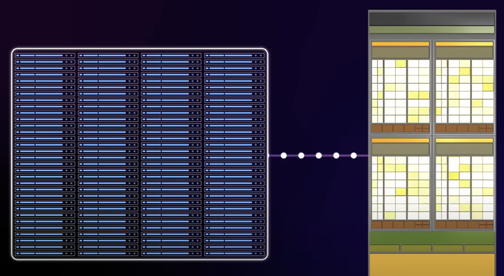

# GPU는 어떻게 작동할까

## 서문

- 좋은 영상이 있어서 작성합니다. (이 분 영상 퀄리티 정말 좋아요!)
- GPU 동작에 대한 개요입니다.
- 레퍼런스: https://www.youtube.com/watch?v=ZdITviTD3VM&t=323s

---

## 요약

### **CPU**

- **소수의 고성능 코어**를 빠르게 동작시키는 방식으로 발전
- 복잡한 분기 처리(조건문, 다양한 로직 등), 크고 작은 작업의 스케줄링, 운영체제 관리 기능 등 두뇌 역할 수행
- 다수의 코어를 탑재하지만, GPU처럼 수천 수만 개의 코어를 갖기는 어렵고, 대신 **단일 코어의 성능을 매우 높게** 끌어올림
- 지연 시간(latency)을 최소화하기 위해 큰 용량의 캐시 메모리를 사용하며, 연산을 효율적으로 처리할 수 있는 파이프라인 구조를 가짐

### **GPU**

- **성능은 낮더라도 ‘많은 수’의 코어**를 한 번에 탑재하여 대규모 병렬 처리에 최적화
- 동일한 연산을 엄청나게 많이, 동시에 수행해야 하는 2D/3D 그래픽 연산이 주된 목적
- **SIMD / SIMT** 구조를 이용해, 병렬성을 극대화
- 지연 시간보다는 **처리량(throughput)** 을 극대화하기 위한 설계
- 캐시 구조는 CPU에 비해 단순하지만, 대신 코어가 매우 많고, 워프(Warp) 또는 스레드 교체를 통해 메모리 지연시간을 숨기는 방식으로 고성능 달성

---

## 픽셀 연산과 3D 렌더링 파이프라인

### **1초에 표현해야 하는 픽셀 수**

- 예: 1920×1080 해상도 → 대략 200만 픽셀
  - 동영상 - 이미지 한 장 한 장 빠르게 표시해 마치 움직이는 것처럼 보이게 하는 것
  - 일반 동영상 30프레임 → 1초에 약 6천만(2백만×30) 픽셀 계산 (보통 1초에 30장)
  - 게임에서 60프레임 + 3차원 모델에 대한 조명, 텍스처, 쉐이딩 등이 추가 → 훨씬 더 많은 연산 필요
  - GPU는 이처럼 모니터에 뿌려질 픽셀의 정보 계산
    - 픽셀의 정보를 CPU 통해서 계산할 수도 있지만.. 단순 계산하긴 아까움

### 픽셀이 가지고 있는 정보

- 그 전에 3D 그래픽이 표현되는 방식
  - 기본 단위는 삼각형
  - 3차원 모델은 점선면으로 이루어져 있음, 점과 점 이으면 → 선, 선과 선 채우면 → 면
  - 3차원 모델을 구성하는 점(정점, vertex)을 연결하여 ‘선’, ‘면(폴리곤)’을 형성 → 삼각형 메쉬 (폴리곤 메쉬: 정점들을 서로 연결해서 만든 3차원 모델, 다각형 그물형태), 삼각형을 이용해 그물처럼 서로 연결해가며 3차원 모델을 만들어간다고 이해
  - 최종적으로 **모니터에 표시되는 색상(RGB)**, 깊이(z값), 알파(투명도) 등을 포함함
  - 3차원 그래픽의 경우, 2차원 이미지로 ‘투영(projection)’하기 위해 각 정점(vertex) 데이터(위치, 노말, 텍스처 좌표 등)로부터 연산 수행
  - 각각의 정점들을 위치를 표시할 수있는 좌표값 가지고 있음 (위치정보)
  - 노말: 각 점들에 수직 방향으로 표현되는 정보, 정점이 어느 방향을 향하는지 알기 위해 필요한 정보, 일반적으로 3차원 모델의 바깥쪽으로 노말값을 표현
  - 3차원 모델에 색상 입혀주기
    - 각 정점의 이미지에 대한 정보 필요
    - 이미지 좌표 (texture coordinate)
  - 이 밖에 많은 정보들이 정점의 데이터에 저장됨
    - 이 정점 데이터를 GPU에 입력하면 입력받은 정보에 대해 연산을 수행
    - 입력받은 정점 데이터는 GPU프로그램을 통해 삼각형으로 만들어줌
    - 삼각형은 결국 모니터에는 픽셀로 표시되어야 함
    - 삼각형을 픽셀로 채워주기 위해 픽셀의 구역을 나눠줌
      
    - 이 때 만들어진 예비 픽셀을 프래그먼트라고 함
    - 정점 데이터에서 받은 노말 값의 평균을 이용해 이 조각들의 노말값을 계산해 줌
      
    - [픽셀화] 그리고 이 조각에 색을 입혀주기 위해서 이미지에 대한 정보를 조각들마다 계산해줌
    - [이미지화] 빛을 이용한 명암의 차이도 표현
      
    - 또한 깊이(z-depth) 정보를 이용해 뒤에 있는 물체가 가리게 되면 그 픽셀은 표현되지 않도록 계산
      
    - 3차원 정보라고 해도 결국 모니터는 2차원이기 때문에 이런 과정이 필요
    - 이런 과정을 통해 프래그먼트 조각들은 최종 픽셀로 만들어지고 모니터에 표현됨
      
    - 그래서 정점 데이터에는
      - 정점의 위치에 대한 정보
      - 노말에 대한 정보
      - 이미지 좌표에 대한 정보
      - 깊이에 대한 정보 등
      - 많은 정보가 담겨 있음
      - 변하는 정점의 데이터를 계속 계산해줘야 함
        
      - 연산 - 행렬 곱셈 형태
      - 수십 만개에 달하는 정점 데이터를 행렬의 곱셈으로 실시간 계산하고 모니터에 뿌려줄 픽셀을 만들어줘야 함. 이것이 GPU의 역할

### 픽셀 연산 요약

- 3차원 모델을 구성하는 점(정점)을 연결하여 ‘선’, ‘면(폴리곤)’을 형성 → 삼각형 메쉬
- 각 정점에는 위치, 노말, 텍스처 좌표, 경우에 따라 조명/색상 정보 등이 담김
- GPU는 이 정점들을 받아서 **버텍스 셰이더(Vertex Shader)** → **래스터라이즈(Rasterize; 삼각형을 2D 픽셀 공간으로 쪼개기)** → **프래그먼트 셰이더(Fragment Shader, 픽셀 셰이더)** 등의 단계를 거쳐 최종 픽셀을 생성

- **버텍스 셰이더**
  - 각 정점 위치를 월드 좌표, 카메라 좌표, 화면 좌표로 변환(행렬 곱)
  - 노말 벡터를 변환
  - 텍스처 좌표 변환 및 기타 속성 계산
- **래스터화(Rasterization)**
  - 삼각형을 스크린 상의 픽셀 단위(프래그먼트)로 분할
  - 각 프래그먼트에 대해 정점 정보(노말, 텍스처 좌표 등)를 보간(Interpolating)
- **프래그먼트 셰이더(픽셀 셰이더)**
  - 각 프래그먼트가 최종적으로 어떤 색상이 될지 계산(조명 모델, 텍스처 매핑, 그림자, 반사 등)
  - 깊이(z-depth) 비교로 앞뒤 관계를 처리(occlusion)
  - 알파 블렌딩(투명도 처리) 등 후처리를 거쳐 최종 픽셀 색을 구함
- **프레임버퍼(Frame Buffer)**
  - 최종 픽셀 색을 메모리에 기록
  - 모니터에 뿌려서 화면에 출력

## GPU 셰이더 언어와 컴파일

### 요약

- **HLSL**, **GLSL** 등의 고급 셰이더 언어로 작성된 코드는 GPU가 이해할 수 있는 기계어 형태로 컴파일됨
- **셰이더(Shader)** 코드:
  - 버텍스 셰이더: 정점 변환, 정점 색상/노말 계산
  - 프래그먼트(픽셀) 셰이더: 텍스처 샘플링, 조명 계산, 색상 출력
- 실제 GPU 내부에서는 **ALU(Arithmetic Logic Unit)** 가 셰이더를 수행, 레지스터에 데이터를 담아 연산, 결과를 출력 레지스터로 내보냄
- 현대 GPU는 한 번에 여러 픽셀(프래그먼트)을 병렬 연산(SIMD)하는 구조를 사용

### 셰이더 언어

- **HLSL(High Level Shading Language)**:

  - DirectX(주로 Windows 환경)에서 사용되는 셰이더 언어
  - `.fx`, `.hlsl` 등의 확장자를 사용
  - 예시 코드

    ```hlsl
    sampler mySamp;
    Texture2D<float3> myText;
    float3 lightDir;

    float4 diffuseShader(float3 norm, float2 uv)
    {
        float3 kd;
        kd = myText.Sample(mySamp, uv);
        kd *= clamp(dot(lightDir, norm), 0.0, 1.0);
        return float4(kd, 1.0);
    }

    /**
    mySamp: 텍스처 샘플러
    myText: float3 채널(RGB)의 2D 텍스처
    lightDir: 광원 방향 벡터
    diffuseShader: 노말(norm)과 텍스처 좌표(uv)를 받아 간단한 디퓨즈 셰이딩을 수행
    */
    ```

- **GLSL(OpenGL Shading Language)**:

  - OpenGL(주로 다양한 플랫폼에서 사용 가능)에서 사용되는 셰이더 언어
  - `.glsl`, `.vert`, `.frag` 등의 확장자를 사용
  - 예시 코드

    ```glsl
    #version 330 core

    // GLSL에서의 텍스처와 샘플러는 주로 이런 식으로 선언
    uniform sampler2D myText; // 텍스처 (RGB 채널을 포함)
    uniform vec3 lightDir;    // 광원 방향 (HLSL의 float3 lightDir 대응)

    // diffuseShader 함수
    vec4 diffuseShader(vec3 norm, vec2 uv)
    {
        // 텍스처 샘플링 (texture 함수 사용)
        vec3 kd = texture(myText, uv).rgb;
        // dot(lightDir, norm) 결과를 [0.0, 1.0] 범위로 clamp
        kd *= clamp(dot(lightDir, norm), 0.0, 1.0);
        // 최종 색상 (알파 = 1.0)
        return vec4(kd, 1.0);
    }
    ```

- 이것을 GPU가 이해할 수 있는 기계어로 컴파일
  ```wasm
  <diffuseShader>:
  sample r0, v4, t0, s0    // 텍스처 샘플링 -> r0
  mul    r3, v0, cb0[0]    // (예시) dot(lightDir, norm) 계산 관련
  madd   r3, v1, cb0[1], r3
  madd   r3, v2, cb0[2], r3
  clmp   r3, r3, l(0.0), l(1.0)  // clamp(...)
  mul    o0, r0, r3         // kd.x
  mul    o1, r0, r3         // kd.y
  mul    o2, r0, r3         // kd.z
  mov    o3, l(1.0)         // 알파 채널 = 1.0
  ```
  - `sample r0, v4, t0, s0`: `v4` (UV 좌표)로 텍스처 `t0`를 샘플링해 결과를 `r0` 레지스터에 저장
  - `mul`, `madd`: 벡터 연산 및 `dot(lightDir, norm)` 등을 구현한 예시
  - `clmp`: `clamp`(최소값 0.0, 최대값 1.0)으로 결과를 제한
  - `mul o0, o1, o2, ...`: 픽셀 셰이더의 출력 레지스터(`o0`, `o1`, `o2` 등)에 최종 색상(RGB)을 대입
  - `mov o3, l(1.0)`: 알파 채널을 1.0으로 설정
- 1개의 프래그먼트는 이 명령에 의해 처리됨
- 하나의 프래그먼트는 코어 안에 있는 산술 논리 장치인 ALU에서 처리됨
  - 코어 개수만큼 병렬 연산 가능
    
  - 하나의 명령어로 8개의 프래그먼트가 한꺼번에 계산
    

### SIMD (Single Instruction Multiple Data)

- 하나의 명령으로 여러 개의 데이터를 얻어내는 방식
  - 예: 한 번에 8개의 프래그먼트에 대해 `dot(lightDir, norm)` 같은 명령을 **동시에** 적용
- 코어가 많을 수록 더 많은 프래그먼트가 한 번에 계산
  
- 프래그먼트 뿐만 아니고 픽셀을 만들기 위한 모든 정보들이 이런 방식으로 처리
- 그래픽의 연산은 각각의 정점이나 픽셀마다 독립적으로 계산, 우선순위가 필요 없음
- 대량의 데이터를 처리하고자 하는 욕구
- 하지만 GPU는 그래픽 처리를 목적으로 만들어졌기 때문에 데이터의 형식을 그래픽이 처리되는 형태로 바꿔줘야 하는 번거로움이 있음 (행렬의 곱셈방식으로 많은 데이터를 매번 계산, 적합하지 않을때가 있음..)
- 이런 사람들의 불편함을 개선하고자 CUDA(Nvidia사에서 제공하는 GPU 프로그램)나 OpenCL 같은 프로그램이 개발됨

### SIMT (Single Instruction Multiple Threading)

- GPU가 처리해야할 100개의 작업이 있다고 가정
- 코어가 처리해야할 하나의 작업을 스레드라고 한다면 서로 독립적인 100개의 스레드를 처리할 가장 이상적인 방법은 100개의 코어에 각각하나씩 할당하는 SIMD 방법
- 하지만 GPU가 처리해야할 스레드는 너무 많음, 100만개의 스레드를 처리하기 위해 100만개의 코어를 이용하면 좋지만 불가능 (코어는 불과 몇 천개)
- 그래서 GPU는 SIMT라는 방식으로 작업을 처리 (Single Instruction Multiple Threading), 스레드 중심 처리 방식
- 100만개의 스레드를 천 개의 코어에서 계산한다고 생각하면 100만개의 스레드를 1000개의 코어 중 어디론가 보내야 함
- 이 때 코어를 10개씩 묶는다면? → 분배가 좀 쉬워짐
  
- 이 때 스레드를 1000개씩 묶는다면? → 분배가 좀 더 쉬워짐
  
- 하나의 코어 그룹에서 처리되는 스레드는 1000개 (예시)
  
  - 그렇다면 이제 배정받은 묶인 스레드 내에서 다시 그룹이 만들어지고, 이 그룹은 순서대로 처리되게 되는데, 이 그룹을 워프라고 함
    
    - 하나의 워프에 속해있는 스레드는 마치 하나의 작업처럼 처리되게 됨
- CUDA(엔비디아) 등에서 사용하는 GPU의 **스레드 기반** 병렬 처리 모델
- CPU처럼 한 코어가 한 스레드를 처리하는 개념을 조금 더 단순화/확장 → GPU는 **수천~수만 개 스레드**를 관리
- 실제 코어 수가 ‘스레드 수’만큼 되지 않으므로, 스케줄러가 많은 스레드를 코어 그룹에 할당 → **워프(Warp)** 단위로 묶어서 번갈아가며 실행
- 워프 내부에서는 모든 스레드가 거의 같은 명령어를 동시에 실행(SIMD와 유사)
- 메모리 지연이 발생하면 다음 워프로 전환하여 코어가 쉬지 않고 계속 연산 가능

### 예시: CUDA에서의 스레드 배분

- 다시 살펴보자!
  1. GPU가 처리해야 할 작업(스레드)이 100만 개 있다고 가정
  2. GPU에는 실제로 코어(프로세서)가 수천 개 존재
  3. 100만 개 스레드를 바로 1:1로 매칭하기는 불가능 → 스레드들을 ‘블록(Block)’ 단위로 묶고, 각 블록을 ‘그리드(Grid)’로 구성
  4. 블록 내부에서 다시 워프(Warp) 단위로 묶어, 실제 코어 그룹에 할당
  5. **워프** 단위 실행: 한 워프(예: 32개 또는 64~128개 스레드) 내의 스레드는 동일한 명령어를 동시에 실행하지만, 다른 데이터나 메모리를 참조
  6. 어떤 스레드가 메모리 접근으로 지연이 생기면, GPU는 즉시 다음 워프를 실행 → **지연을 ‘숨김(Hide)’**
     이 방식으로 **‘스레드 수가 많을수록’** GPU가 효율적으로 지연시간을 상쇄하며 높은 처리량을 발휘.

### 실제 예시: NVIDIA RTX3090

- **CUDA 코어**(또는 SM당 코어)가 만 개 이상
- 이 코어들이 128개 혹은 64개씩 묶여서 하나의 SM(Streaming Multiprocessor)을 이룸 (개수는 예시, 실제로 몇 개 들어가 있는지 서치 필요)
- 하나의 워프 = 32 또는 64~128개의 스레드(아키텍처에 따라 다름), 128개의 스레드가 들어있는 워프들이 코어 그룹 안에서 연산됨
- SM에서 워프별로 스케줄러가 돌아가며 스레드를 실행
  - 워프에 포함된 모든 스레드가 **동시에** 같은 명령어를 실행
  - 메모리 접근 지연이 생기면 즉시 다른 워프로 교체
- CPU에 비해 큰 캐시는 없지만, **압도적인 병렬성 + 워프 스위칭**으로 지연시간을 숨김
  
- 워프 안에는 128개의 스레드가 들어 있고, 코어 그룹 안에는 128개의 코어가 들어있기 때문에 하나의 스레드가 하나의 코어에 할당되어 연산을 수행
- 코어가 연산을 수행하다가 메모리로부터 데이터를 읽어올 때 잠시 대기하는 시간이 생기게 됨 → 지연시간
- CPU같은 경우 지연시간을 최대한 줄이기 위해 코어 근처에 캐시메모리를 만드는 방법을 사용
- 반면 GPU같은 겨우 코어 그룹에서 하나의 워프를 수행하다가, 지연시간이 발생하면 바로 다음 워프를 수행, 이 워프를 수행하다가 지연시간이 발생하면 다시 다음 워프를 수행함으로써 계속해서 연산이 이뤄질 수 있게 함
  - 즉, GPU에서는 코어가 쉴 틈없이 계속해서 연산을 수행하는 셈
  - 지연시간을 없게 하려면 그만큼 스레드가 많이 있어야 효율이 좋음
  - 이와 같은 방식으로 GPU는 대량의 데이터를 병렬 처리하는데 있어 효율이 좋음

## GPU의 폭넓은 활용 분야

- **그래픽 렌더링**
  - 게임, 3D 모델링, 애니메이션, 가상현실(VR) 등
  - 기존 목적이 ‘그래픽 연산’이었으므로 가장 표준적인 사용 사례
- **딥러닝/머신러닝**
  - 신경망 연산(수많은 행렬 곱셈)이 주요 연산 → GPU의 병렬 행렬 연산 능력이 CPU보다 월등
  - 텐서코어(Tensor Core) 같은 추가 하드웨어 블록을 통해 더 빠른 연산 지원
- **비트코인/암호화폐 채굴**
  - 해시 함수(SHA-256 등)를 반복적으로 계산해야 함
  - 동일한 연산을 대규모로 수행하므로 GPU가 유리
- **과학/공학 시뮬레이션**
  - 예: 기상 예측(날씨 예보), 유체 시뮬레이션, 생물학적 계산(단백질 구조 예측) 등
  - HPC(고성능 컴퓨팅) 분야에서 GPU 클러스터를 구성해 슈퍼컴퓨터를 구축하기도 함
- **영상/이미지 처리**
  - 예: OpenCV를 통한 이미지 필터링, 영상 편집 소프트웨어의 실시간 인코딩/디코딩, 후처리 이펙트
  - 필터 적용, 합성, 인코딩 등에 GPU 사용 시 실시간으로 대규모 연산 수행 가능
