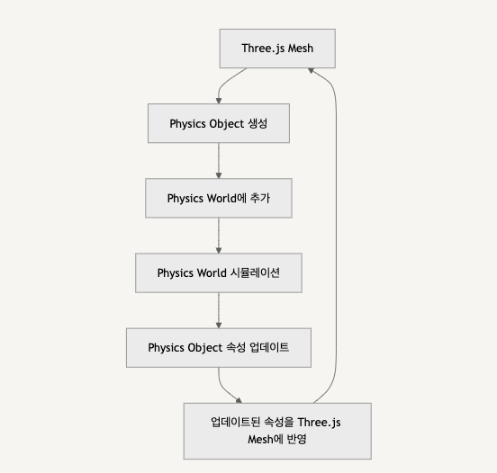
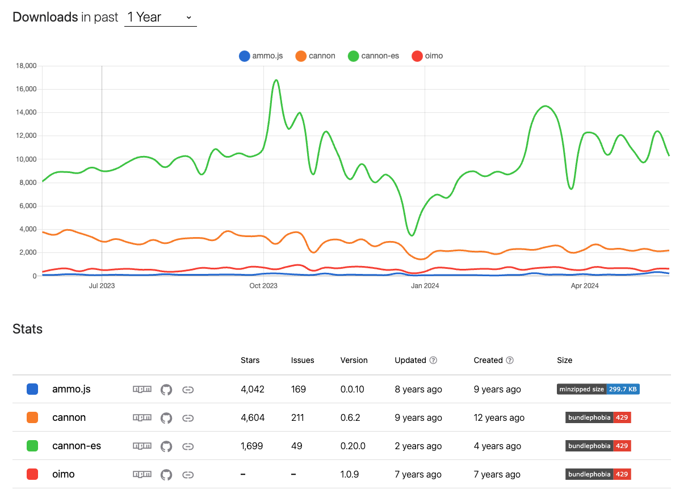

## 레퍼런스

https://threejs-journey.com/lessons/physics

## 강의내용

### 들어가며

- 왜 Physics?

  - 3d → 생동감 있게 보이기 위해!
  - 물리법칙들 사용, 보다 현실적인 느낌
  - Raycaster와 같은 몇 가지 수식과 솔루션을 사용해 자신만의 Physics를 구현할 수도 있지만 마찰, 탄성 등의 사실적인 물리법칙들을 (~~편하게~~) 구현하기 위해서는 라이브러리를 사용하는 것도 지향
  - 라이브러리 사용하지 않는다면?

    - ???: 중력을 구현해보자!
    - 객체의 속도 / 위치 저장하는 변수
    - 매 프레임마다 속도와 위치를 갱신 (중력 가속도 이용해 계산)
    - 지면과의 충돌 계산에는 raycaster 이용, bounding box와 같은 개념으로 경계 계산해서 충돌 여부 판단
    - 즉 프레임 별로 명시적으로 지정해줘야할 것들이 굉장히 많음

      ```tsx
      const gravity = -9.82;
      const objects = [];

      // 객체 생성 및 초기화
      const createObject = () => {
        const obj = {
          position: new THREE.Vector3(), // 객체의 위치를 저장할 THREE.Vector3 인스턴스를 생성
          velocity: new THREE.Vector3(),
          // ...
        };
        objects.push(obj);
      };

      // 물리량 직접 계산
      const updatePhysics = deltaTime => {
        for (const obj of objects) {
          // 중력에 따른 속도 업데이트
          obj.velocity.y += gravity * deltaTime;

          // 속도에 따른 위치 업데이트
          obj.position.addScaledVector(obj.velocity, deltaTime);

          // 충돌 감지 및 처리
          // ...
        }
      };

      // vs

      const world = new CANNON.World();
      world.gravity.set(0, -9.82, 0);
      //..
      world.step(1 / 60, deltaTime, 3);
      ```

### n줄 요약



- 물리 법칙이 적용되는 전역 객체인 **Physics world** (from 모듈)를 만듦, 이 객체는 물체와 그들의 상호작용을 관리함
- Three.js에서 물리 법칙이 적용되어야 하는 Mesh를 만듦. 단, 모든 Mesh가 Physics world에 추가될 필요는 없고, 정적인 배경 요소나 물리 시뮬레이션과 상호작용하지 않는 객체들은 제외가능 (등록하고 싶은만큼 등록)
- Physics world에 Three.js Mesh에 대응하는 Physics object를 만듦. 이때 Physics object의 초기 위치, 크기, 질량, 재질 등의 속성을 설정
- Physics world에 중력, 마찰력 등의 조건을 설정하여 물리 법칙에 따라 시뮬레이션이 진행되도록 함
- 시뮬레이션이 진행되면서 Physics world는 설정된 조건에 따라 Physics object들의 위치, 속도, 회전 등의 속성을 업데이트
- 업데이트된 Physics object의 속성을 가져와서 해당하는 Three.js Mesh의 속성에 반영. 이를 통해 Three.js로 렌더링된 장면에서 물리적으로 사실적인 움직임과 상호작용을 구현할 수 있음!

### 내용 및 용어정리

⛔️ 물리엔진 속 용어는 Cannon를 기준으로 기술

#### Overview

- Base
  - Object
    - `World` (Cannon) - 물리 법칙이 적용되는 물체와 그들의 상호작용을 관리하는 객체, World 객체는 중력, 충돌 감지, 물체의 물리적 특성을 포함한 전반적인 물리 엔진 설정을 포함
    - `Body` (Cannon) - 물리량을 가진 물체를 담을 수 있는 객체, 다른 Body들과 충돌하거나 상호작용
  - Update the Cannon.js world and the Three.js scene
    - 중력을 이용한 예시
    - step 함수
- Contact material
  - 재질 정의, 반발력, 마찰력
- Apply forces
  - 힘에 대한 이야기
  - applyForce, applyImpulse, applyLocalForce, applyLocalImpulse 등
- Handle multiple objects - 보편화
  - Automate with functions
    - Three.js와 cannon.js를 동시에 초기화하는 함수로직
  - Use an array of objects
    - 모든 객체를 한 번에 업데이트 (physics world → three world)
  - Add to lil-gui
    - 컨트롤러에 추가
  - Optimize
    - 재사용 가능한 geometry와 Material은 재사용하자
- Add boxes
- Performance
  - Broadphase
    - **_Broad phase_** collision detection, 충돌을 테스트하기 위함
  - sleep - 휴면상태
- Events
  - Body 객체에 이벤트리스너 콜백 등록 가능, e.g. 물체가 충돌할 때 소리 재생, 발사체가 닿았는지 체크 등
  - collide, sleep, wakeup 등
  - 발생한 이벤트에 대한 정보도 알 수 있음 e.g. `(collision) => { collision.contact... }`
- Remove things
  - 초기화 및 클린업

### Gravity

- 기본 코드

  ```tsx
  const world = new CANNON.World();
  world.gravity.set(0, -9.82, 0);

  // set(x: number, y: number, z: number): Vec3;

  const sphereBody = new CANNON.Body({
    mass: 1,
    position: new CANNON.Vec3(0, 3, 0),
    shape: sphereShape,
  });
  world.addBody(sphereBody);
  ```

  - 우리가 한 것: 물리 세계 만들기 + 물체 넣기

- 물리 세계의 시간을 흐르게 하자! (tick)

  - 수동 업데이트, step

    ```tsx
    const clock = new THREE.Clock(); // 인스턴스 생성 시점부터 경과 시간 측정
    let oldElapsedTime = 0;

    const tick = () => {
      const elapsedTime = clock.getElapsedTime(); // 현재 프레임의 경과 시간 저장
      const deltaTime = elapsedTime - oldElapsedTime; // 이전 ~ 현재의 경과 시간 저장
      oldElapsedTime = elapsedTime; // 갱신

      world.step(1 / 60, deltaTime, 3);
    };

    // step(dt: number, timeSinceLastCalled?: number, maxSubSteps?: number): void;
    // params: 시간 단계, 경과 시간, 반복 횟수
    ```

  - https://gafferongames.com/post/fix_your_timestep/
  - step 함수
    - **시간에 따른 물리량을 계산하고, 물체의 위치와 속도를 업데이트**하는 역할 (물리 시뮬레이션이 시간에 따라 변화하며 현실적인 물리 현상을 재현, 시뮬레이션의 한 프레임을 업데이트, 주어진 시간 동안 물체의 위치, 속도, 충돌 등을 계산하여 물리 세계를 진행)
  - params; dt: 시뮬레이션의 고정 시간 간격, 시뮬레이션을 얼마나 자주 업데이트 할 것인지 결정
  - params; maxSubSteps: 한 프레임 내에서 시뮬레이션을 수행할 최대 하위 단계 수
    - 한 프레임을 최대 몇 개의 하위 단계로 나눌 것인지를 의미
    - 실제 프레임 간 시간 간격(deltaTime) 사이의 차이를 조정하는 데 사용

### 반발과 마찰

- restitution / friction
  ```tsx
  const floorShape = new CANNON.Plane();
  const floorBody = new CANNON.Body();
  floorBody.mass = 0;
  floorBody.addShape(floorShape);
  world.addBody(floorBody);
  ```
  - cannon에서는 회전에 quaternion을 사용
    e.g. floorBody.quaternion.setFromAxisAngle(new CANNON.Vec3(- 1, 0, 0), Math.PI \* 0.5)
  - 쿼터니언이 궁금하다면? [팀원 발표 자료](https://www.notion.so/cdb6ba30b5a64682a12e3e42f34df67d?pvs=21)
- 질량이 0
  - 진짜 0인가? 0에 가까운가?
    - 현실 세계와는 좀 다르게, 0이다
  - cannon-es에서 물체의 질량을 0으로 설정하는 건 고정된 상태를 나타내기 위함
    - 질량이 0인 물체는 물리 시뮬레이션에 참여하지 않는 정적 물체
    - F = ma, 즉 F = mg (g는 대략 9.82m/s^2)
  - 고정된 환경 요소
    - 바닥, 벽, 장애물 등 힘으로 밀리지 않는 고정된 환경 요소를 구현할 때 사용
    - 다른 물체들과의 상호작용에서 고정된 기준 역할
- 공을 튀게하자!
  - 반발력 / 마찰력
  - 각각의 재질을 정의 (1. 물체 고유의 특성을 정의)
    ```tsx
    const concreteMaterial = new CANNON.Material("concrete");
    const plasticMaterial = new CANNON.Material("plastic");
    ```
  - 부딪힐(상호작용) 때 필요한 물리량들을 정의 (2. 상호작용 시 특성 정의)
    ```tsx
    const concretePlasticContactMaterial = new CANNON.ContactMaterial(
      concreteMaterial,
      plasticMaterial,
      {
        friction: 0.1, // 마찰계수
        restitution: 0.7, // 반발계수
      }
    );
    world.addContactMaterial(concretePlasticContactMaterial);
    ```
    - [반발계수](https://ko.wikipedia.org/wiki/%EB%B0%98%EB%B0%9C_%EA%B3%84%EC%88%98) (Restitution, 0~1)
      - **두 물체가 충돌할 때 충돌 전후의 상대속도의 비** (얼마나 탄성적으로 반응하는지)
      - 0: 완전히 비탄성 충돌을 의미, 충돌 후 물체가 전혀 튀지 않고, 모든 운동 에너지가 소실
      - 0.3: 약간의 탄성 충돌을 의미, 충돌 후 물체가 약간 튀어오름
      - 1: 완전히 탄성 충돌을 의미, 충돌 후 물체가 원래의 높이로 완전히 튀어오름
    - 마찰계수 (Friction, 0~1)
      - **맞닿은 두 표면 사이의 마찰 정도**
      - 1: 높은 마찰을 의미, 물체가 미끄러지기 어려움
      - 0.3: 약간의 마찰을 의미, 물체가 비교적 쉽게 미끄러지지만 어느 정도 저항력이 있음
      - 0: 마찰이 전혀 없는 상태를 의미, 물체가 매우 쉽게 미끄러짐

### 힘

- 힘과 관련해 위치에 변화를 줄 수 있는 메서드들
  - `applyForce`
    - 물체에 특정 지점에서 힘을 가하는 데 사용
    - 이 지점은 물체의 표면 위일 필요는 없으며, 공간상의 임의의 점일 수 있음
    - 물체의 속도 변화를 일으키는 힘을 누적
    - e.g. 바람이 지속적으로 물체를 미는 것
  - `applyImpulse`
    - applyForce와 비슷하지만, 힘을 더해서 속도를 변경하는 대신 직접 속도에 영향을 줌
    - 순간적인 변화가 일어남
    - e.g. 물체가 다른 물체와 충돌할 때 충격량을 적용하여 속도를 변경 (발로 공 뻥차기)
  - `applyLocalForce`
    - applyForce와 비슷하지만, 좌표가 물체 기준
    - 힘의 방향이 물체를 기준으로 정해짐
  - `applyLocalImpulse`
    - applyImpulse와 동일하지만, 좌표가 물체 기준
    - 힘의 방향이 물체를 기준으로 정해짐
- 물체를 어떻게 움직이고 싶냐에 따라 적절한 함수를 사용하면 됨

### 리팩토링 / 최적화

- 리팩토링
  - Three.js와 Cannon.js를 동시에 사용하여 한 번에 객체를 만드는 기본 함수 작성
  - World와 Three.js 장면을 동기화하여 객체들의 위치를 업데이트 (objectsToUpdate 배열을 사용하여 모든 객체를 순회)
- 최적화
  - 재사용 가능한 Geometry와 Material은 재사용
  - Q. 모든 속성을 복사
    ```tsx
    object.mesh.position.copy(object.body.position);
    object.mesh.quaternion.copy(object.body.quaternion);
    ```
    - 변경된 객체만 감지해서 업데이트 해줄 수 있다면?
    - 질량이 없거나, 이전 상태와 diff를 비교해 없다면 지나간다면?
      - diff 비교하는 비용과 비슷한가? (확인필요)
  - Q. createSphere, createBox가 유사한 로직 가지고 있는데 함수 분리되어있음
    - 함수 통합 후 매개변수/switch 분기해 구분하는 것도
  - Q. three.js 객체와 cannon 객체를 동기화 해주는 거면, cannon에서의 객체와 three에서의 객체는 정의된 형태가 조금씩 다를 수 있고, 모양이 같지 않을 수도 있지않나? 충돌 처리 시 사소한 차이가 문제가 될 수 있을 것 같은데?
    - 스케일/회전/위치 일치시키기
    - 충돌 마진을 줘서 물리 엔진의 충돌 감지가 조금 더 유연하게 동작할 수 있도록 함
    - 디버깅 도구를 사용하여 두 엔진 간의 차이를 확인하고 필요한 경우 튜닝 > 확인 필요!
    - 복잡한 모양의 경우는 정밀한 메쉬를 생성해 물리 엔진과 렌더링 엔진의 차이를 최소화
    - 사람 모형처럼 복잡한 형태를 가진 경우는 충돌처리를 일치시키기 위해 바운딩 박스를 커스텀해서 사용

### 퍼포먼스 개선

- broadphase
  - 충돌 테스트에 관한 내용
  - 왜하는가? → 업데이트 시 물체 간의 상호작용을 감지, 처리를 위함
  1. NaiveBroadphase
     - 모든 물체를 다른 모든 물체와 비교하여 충돌 여부를 테스트
     - 가장 단순한 방법이지만, 물체의 수가 많아지면 비효율적
  2. GridBroadphase
     - 3D 공간을 그리드로 나누고, 같은 그리드 셀 내의 물체들만 충돌 테스트를 수행
     - 이 방법은 공간을 분할하여 충돌 테스트의 범위를 줄이는 데 유용
  3. SAPBroadphase (Sweep and Prune Broadphase)
     - 물체들을 축에 따라 정렬하고, 겹치는 부분이 있는 물체 쌍만 충돌 테스트 수행
     - 각 축(x, y, z)에 대해 물체들을 바운딩박스 최솟값을 기준으로 정렬
       - 테스트가 3번인가?
     - 이 방법은 물체들이 축을 따라 정렬되어 있을 때 특히 효율적
- sleep
  - 휴면 상태인 것들 비활성화 (수면상태로 전환, 물리 계산에서 일시적 제외)

→ 함수 구현체 살펴봐도 좋겠다! (언젠가..)

## NPM Trends



- cannon.js → cannon-es
  - 자바스크립트 생태계 변화 (모듈 시스템/ts 등)로 인한 마이그레이션/업데이트 버전

방법 1: ~~직접 만들어본다!~~

방법 2: 인기 순 / last-updated / 이슈 활성화 정도에 따라 선택한다!

방법 3: 프로젝트의 특성에 따라 적합한 라이브러리를 선택한다!

https://threejs-journey.com/lessons/physics#ammo-js

## 프로젝트에 넣으면 재밌을 Physics

- 강의에서 제안해준 것
  - HingeConstraint: door hinge와 같은 제약
  - DistanceConstraint: 일정한 거리를 유지하도록 함
  - LockConstraint: 한 조각인 것처럼 두 body를 합침
  - PointToPointConstraint: 특정 포인트에 body를 붙임
- 그 외
  - 변형 가능한 재질의 물체 조작
    https://threejs.org/examples/?q=physics#physics_ammo_volume
  - 유체 조작
  - 바람 불기

## Three.js 예제

- physics
  [three.js examples](https://threejs.org/examples/?q=physics#physics_ammo_rope)

## 해볼까?

- [ ] 오늘 강의 내용을 다른 라이브러리로 마이그레이션 해보기
- [ ] 타 Physics 적용한 예제 만들어보기
