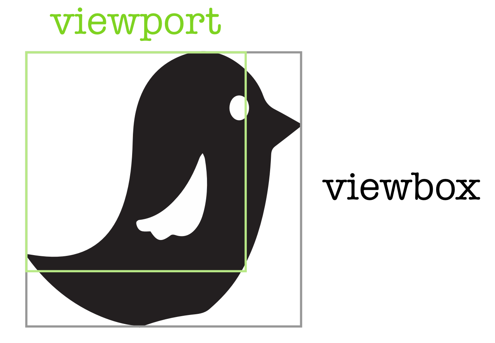
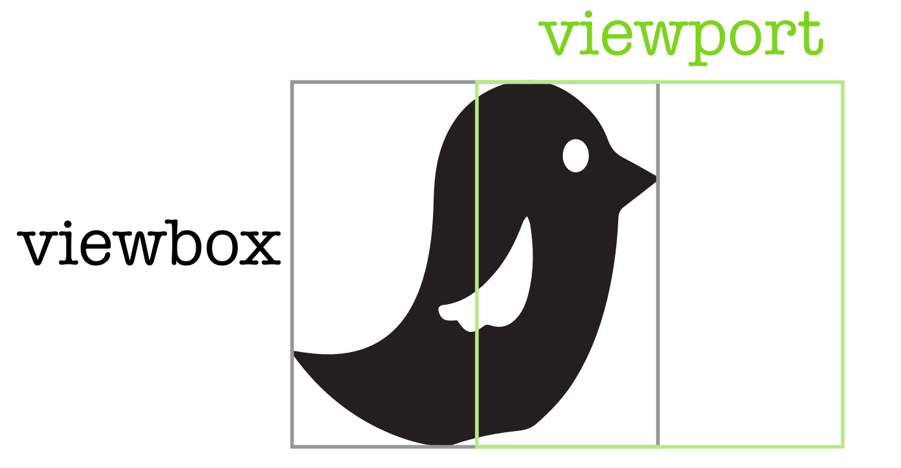
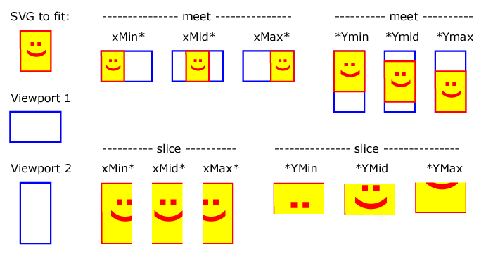

# SVG 생각의 흐름

## 레퍼런스

- https://www.w3.org/People/chris/SVGtut-WWW9/slide45.html
- https://www.digitalocean.com/community/tutorials/svg-svg-viewbox
- https://www.w3.org/TR/SVG2/coords.html

## **ViewBox**

### ViewBox 기본

- https://www.digitalocean.com/community/tutorials/svg-svg-viewbox
- SVG의 좌표계를 정의하는 가상의 창
- viewBox="x y width height" 형식으로 정의 (네 가지 값을 공백 또는 쉼표로 구분해 설정)
  - **x**: 최소 x 좌표를 지정
  - **y**: 최소 y 좌표를 지정
  - **width**: 사용자 좌표(또는 px 단위)에서의 너비 → px인데 어떻게 비율? 음
  - **height**: 사용자 좌표(또는 px 단위)에서의 높이
- viewport(우리가 실질적으로 보게될 것)와 viewBox는 같지 않다!

  - 원래 `viewBox="0 0 100 100"` 이던걸 `viewBox="0 0 75 75"` 로 하면
    
    - `viewport`는 우리가 이미지를 보는 ‘창(Window)’이고, `viewBox`는 그 이미지를 어떻게 스케일링하고 위치시킬지 정하는 ‘도구’
    - **뷰포트(viewport)** = 실제 보이는 “창(Window)”
    - **뷰박스(viewBox)** = 그 “창”을 통해 볼 “장면(좌표 공간)”
    - `viewBox`는 실제 화면(뷰포트)에 SVG를 어떻게 배치(스케일/위치 이동)할지를 결정
    - 즉, 카메라(뷰박스)로 SVG 내부 좌표계를 어느 지점부터 어디까지, 얼마나 크게(또는 작게) 찍어서 화면(뷰포트)에 보여줄 것인가?를 정하는 셈
  - `viewBox="50 0 100 100”` 인 경우
    

- 실제 SVG 요소의 크기와 별개로 내부 좌표계를 설정할 수 있음
- SVG의 `viewBox`에 지정하는 숫자는 **픽셀(px)** 값이라기보다는 **“사용자 좌표계(user coordinate)”** 상의 단위라고 보는 게 더 정확
- `viewBox="0 0 100 100"`이라고 했을 때 이 100×100은 실제 화면에서의 100px×100px를 의미하는 것이 아니라, **SVG 내부에서 정해놓은 “가상의 좌표 공간”** 을 뜻함.
- 브라우저는 이 가상의 좌표 공간(예: 0 ~ 100)과 실제 렌더링될 화면 상의 픽셀(예: 0 ~ 200px, 0 ~ 500px 등) 사이를 **비율에 맞춰 매핑함**.
  - 예컨대, 컨테이너의 실제 크기가 200px×200px라면, 0~100 범위가 0~200px로 매핑되어 **2배로 스케일링**되는 셈이고, 컨테이너가 500px×500px이라면 0~100 범위가 0~500px로 매핑되어 **5배로 스케일링**되는 식
  - 결과적으로 컨테이너의 크기에 맞춰 svg가 스케일링된다는 말은 참, `viewBox`에 적힌 숫자(여기선 100)는 단순히 “픽셀 수치”가 아니라 **가상의 좌표 크기**라고 이해하자.
  - 참고로 `path` 요소 안에서 사용하는 (x, y) 좌표들도 **SVG의 사용자 좌표계**를 기준으로 하는 값!
    ```xml
    <svg viewBox="0 0 100 100" ...>
      <path d="M10 10 L90 90" />
    </svg>
    ```
- 왜 쓰는가?
  - SVG가 담길 **컨테이너**(부모 요소)의 크기에 맞추어 확장하거나 축소하도록 만들 수 있음
  - `viewBox`를 올바르게 설정해두면, 이미지를 담고 있는 컨테이너 크기에 맞춰 스케일이 조절되며, SVG 특성상 이미지가 아무리 커져도 또렷하게 보이게 됨
  - 또한 `viewBox`는 이미지를 일부 가리는 등, 특정 영역만 보이게 하는 기능에도 유용한데, 이는 애니메이션 구현 시 특히 도움이 됨
- 사이즈는 보통 **그려진 도형(path 등)의 바운딩 박스(bounding box)**를 기준으로 잡음!
- 요약
    <aside>
    💡
    
    - 뷰포트(`width`, `height` CSS 등으로 지정)는 브라우저가 실제로 몇 픽셀 크기로 SVG를 렌더링할지를 의미
    - 뷰박스(`viewBox="x y width height"`)는 “SVG 안에서 x, y부터 시작해 width×height 범위를 **카메라**로 잡아서” 그 부분을 **뷰포트 크기에 맞춰 스케일링**하겠다는 설정
    </aside>
    
    <aside>
    💡
    
    - **뷰포트**: 실제로 몇 px짜리 “화면 창”인가? (예: 200×200px)
    - **뷰박스**: SVG 내부 가상 좌표계를 어디서부터(예: x=0, y=0) 어느 크기(예: 100×100)로 볼 것인가?
    </aside>

- 드는 질문
  - 왜 “뷰박스가 전체”처럼 보이고, “뷰포트가 작거나 위치가 밀린 것”처럼 느껴질까?
    ### 1) 뷰박스를 작게 잡으면 → 화면에서 오히려 ‘확대’되어 보임
    - 예: 원래 `viewBox="0 0 100 100"`일 때 100×100 범위가 뷰포트(예: 200×200px)에 매핑 → 스케일링 비율은 2배(100 → 200px).
    - 만약 `viewBox="0 0 50 50"`으로 바꾸면, 50×50 범위가 같은 뷰포트(200px)에 매핑되므로 스케일링 비율은 4배(50 → 200px).
      - 즉, **같은 화면 공간에 더 작은 범위를 “꽉 채워” 그리니 ‘확대’된 느낌**이 남.
    ### 2) 뷰박스를 크게 잡으면 → 화면에서 ‘축소’되어 보임
    - 같은 200×200px 뷰포트에 `viewBox="0 0 200 200"`을 주면, 200×200 범위가 200px에 매핑되므로 1배(200 → 200px).
      - 결과적으로 **도형이 작아 보이거나 더 넓은 범위가 보이게 됨**.
    ### 3) 뷰박스의 시작점(x, y)을 옮기면 → 도형이 ‘잘려 보이거나’ ‘옆으로 치우쳐’ 보임
    - 예: `viewBox="50 0 100 100"` → x=50~~150, y=0~~100만 보여주므로, x<50 구간 도형은 잘려 나감.
    - 이때 SVG가 “밀려난” 게 아니라, **카메라가 x=50 지점부터 찍기 시작**하기 때문에 실제로 (0~49)에 위치한 부분은 화면에 안 잡힘.
  - **작은 범위(viewBox) = 큰 배율**
  - **큰 범위(viewBox) = 작은 배율**
  - **시작점이 달라지면 = 보여주는 영역이 옮겨짐**
    이런 식으로, 뷰박스와 뷰포트가 1:1 대응이 아니기 때문에,
    > “뷰박스가 전체를 나타내는데 왜 최종 이미지가 작아/크게 보이거나 밀려나 보이지?” 라는 현상이 생기는 것!
  - **뷰박스 = 카메라가 어떤 범위를 얼마나 크게 잡고, 그것을 뷰포트 창에 매핑하느냐,** 이것만 기억하면 “왜 뷰박스 바꾸는데 이미지가 커졌지? 작아졌지?”를 이해하기 훨씬 쉬움

### ViewBox를 활용한 애니메이션

- 특정 svg를 움직이는 애니메이션을 만들려면, `viewBox`의 **min-x** 값을 변경하기만 하면 됨

### 옵션

- preserveAspectRatio
- 여러 옵션에 따른..



## **BoundingBox (bbox)**

- 요소를 완전히 감싸는 최소 크기의 직사각형
- left, top, width, height로 구성
- 회전된 요소의 경우 rotatedBoundingBox도 별도로 계산
- 레이아웃 계산과 크기 조절에 사용
- **`bbox`(bounding box)** 는 실제로 SVG 내부의 특정 도형(또는 그룹)이 차지하는 **최소한의 사각 영역**을 의미
  - **`viewBox`**:
    - 이 SVG 전체(또는 특정 범위)를 어떻게 보여줄 것인지를 정의하는, **SVG 문서 차원의 좌표계** 개념
    - SVG 파일 전체에 적용되며, ‘카메라’가 무엇을, 얼마나 크게(혹은 작게) 볼 것인지 결정
  - **`bbox`(bounding box)**:
    - 도형(또는 그룹) 자체가 **실제 차지하고 있는 영역**을 감싸는 최소 사각형
    - 예: 어떤 `<path>`가 그려졌다면, 그 path가 (10, 10)부터 (80, 60) 범위 내에 있다면 bounding box는 그 구간을 둘러싼 사각형
    - **도형의 형태·위치·크기에 따라 달라짐**
- SVG에서 말하는 **(Bounding Box)** 는 도형이 *실질적으로 그려지는 영역*을 모두 포함하는 최소 사각형을 의미합니다. 이때 실질적으로 그려진다는 것은, 해당 도형(혹은 그룹)에 **실제 픽셀(혹은 벡터) 형태로 렌더링될 부분**이 존재함을 뜻함.
  - 기준: 알파값 0인지 확인
- getBBox 함수 있음! (https://developer.mozilla.org/ko/docs/Web/API/SVGGraphicsElement/getBBox)
  - 내부는 어떻게 되어있나?
  - SVG 요소에서 사용하는 `getBBox()` 메서드는 해당 SVG 도형(요소)의 *벡터 정보*를 기반으로, _수학적으로_ 바운딩 박스를 계산한다. 즉, 브라우저가 실제로 픽셀을 샘플링(렌더링 결과를 직접 훑어서 확인)하는 것이 아니라, **도형의 좌표·패스(path) 정보 등**을 참고해 **기하(geometry) 계산**으로 직사각형 범위를 구해내는 방식임.
    - **SVG 고유 메서드**
    - **SVG 내부 좌표계(로컬 좌표)**로 바운딩 박스를 반환
    - 픽셀 샘플링 없이 _벡터 정보_ 기반으로 계산
  - 참고로 다른놈임! `getBoundingClientRect()` (https://developer.mozilla.org/en-US/docs/Web/API/Element/getBoundingClientRect)
    - 일반 DOM 요소가 지원하는 **브라우저 표준 메서드**
    - **화면 좌표계(뷰포트 기준)** 에서 해당 요소가 실제로 차지하는 사각형 정보(CSS 픽셀 단위)를 반환
    - 스크롤 위치, 변환(transform), 뷰포트 배율 등에 의해 달라질 수 있음
    - **_실제 화면상 몇 픽셀짜리 박스인지 궁금할 때 활용_**
    - 브라우저의 **레이아웃 엔진이 계산한 기하학적 정보(요소의 위치·크기·변환 등)** 를 바탕으로 “현재 뷰포트(브라우저 화면) 좌표계에서 해당 요소가 차지하는 최소 사각형”을 구해내는 메소드라고 함
    - `getBoundingClientRect()`가 *화면에 뿌려진 실제 픽셀*을 하나하나 확인하는 것은 아님.
    - 따라서 _투명 부분이나 알파 블렌딩, 안에 구멍이 뚫린 도형_ 등은 전혀 신경 쓰지 않고, 요소의 바깥 사각형(박스 모델에 따른 사각형)을 “한 덩어리”로 보고 그 최소·최대 위치를 반환함. (브라우저 레이아웃 엔진이 이미계산해둔 요소의 “뷰포트 기준 위치·크기(사각형)”를 반환
    - 반환값은 보통 **소수 픽셀 단위**로, `(top, left, width, height, bottom, right, x, y, ...)` 등이 담긴 객체
    - 내부 도형이 어떻게 생겼는지(투명 부분, 곡선 등)는 고려하지 않고 **“바깥 테두리”** 기준으로 계산
    - 따라서 “요소가 화면에서 실제로 몇 픽셀 범위를 차지하는가?”를 _수학적으로_ 바로 확인할 수 있고, 픽셀 자체를 훑는 과정은 없으니 성능 부담도 크게 없음
    - 엇.. 그렇다면 브라우저의 레이아웃 엔진은…
      브라우저의 **레이아웃 엔진**은 요소의 크기·위치·정렬 등을 결정할 때, **픽셀을 실제로 ‘읽어서’(렌더링된 결과를 훑어서) 계산하지 않습니다.** 대신 **HTML + CSS(또는 SVG 등)에서 정의한 속성들을 기반으로 수학적·기하학적으로** “이 요소는 가로/세로가 얼마이고, 어떤 좌표에 배치되는지”를 결정합니다.
      ***
      ## 1. 브라우저의 렌더링(레이아웃) 과정 요약
      1. **파싱(Parsing)**
         - 브라우저는 HTML을 해석해 **DOM 트리**를 만듭니다.
         - CSS를 해석해 **CSSOM**(CSS 객체 모델)을 구성합니다.
      2. **렌더 트리(Render Tree) 구성**
         - DOM + CSSOM 정보를 합쳐, “화면에 실제로 보이는 요소들만 포함한” 렌더 트리를 생성합니다.
         - 예: `display: none` 요소는 포함되지 않음.
      3. **레이아웃(Layout) 계산**
         - 각 요소가 **어떤 크기(width, height)** 를 가지는지, **어떤 좌표(x, y)** 에 배치되는지 결정합니다.
         - CSS 박스 모델(box model: margin, border, padding, content), 글꼴 크기, position 속성, float/flow, flex/inline-block 규칙, transform 등의 정보를 **수학적으로** 계산합니다.
         - 예: 부모의 width가 800px이고, 자식이 `width: 50%`라면, 자식 요소 너비는 400px로 계산되는 식.
         - **픽셀을 직접 읽지 않고**, *스타일 규칙에 따른 수치 연산*으로 결정.
      4. **페인팅(Painting)**
         - 레이아웃 엔진으로부터 “어느 좌표에, 어떤 크기의 박스들이 있는지” 정보를 받고, 실제로 픽셀 버퍼에 그려(Paint) 넣는 단계.
         - 텍스트면 폰트 렌더링, 색상/그라디언트/이미지라면 해당 부분을 GPU 등에서 *비트맵*으로 그려 넣습니다.
      5. **합성(Compositing)**
         - 여러 레이어(layer)가 있으면 GPU나 OS 레벨에서 최종 합성하여 화면에 표시.
      ***
      ## 2. 왜 ‘픽셀 읽기’가 필요 없는가?
      - **레이아웃 단계**에서 이미 “이 요소는 너비 200px, 높이 150px, 좌표 (100, 300)에 위치” 같은 값이 **수학적으로** 결정됩니다.
      - 이 결과를 바탕으로 **그리기(페인팅) 단계**에서만 실제 픽셀 버퍼에 채색을 하는 것이지, 레이아웃을 위해 역으로 픽셀을 다시 읽지 않습니다.
        - 즉, “레이아웃 계산 → 픽셀 그리기” 순서이며, **픽셀을 그린 다음 다시 레이아웃 정보로 되돌아오는 과정**이 없는 것
      ***
      ## 3. `getBoundingClientRect()`가 이 정보를 어떻게 가져오나?
      - `getBoundingClientRect()`는 **이미 완료된 레이아웃 결과**(“렌더 트리”가 계산한 요소의 위치·크기)를 **뷰포트 좌표**로 반환
      - 브라우저는 이 단계에서도 **픽셀을 직접 훑을 필요가 없음**
        - “이 DOM 요소는 레이아웃 엔진이 x=100, y=300, width=200, height=150으로 계산했다”는 결과를 메모리(렌더 트리/프레임 트리 등)에 갖고 있으므로, 이를 곧바로 넘겨주는 것
      ***
      ## 4. 결론
      1. **레이아웃 엔진은 CSS 규칙·박스 모델·폰트/텍스트 크기·transform·스크롤 위치 등**을 종합해 **수치적으로** “어디에 어느 크기로 배치할지” 계산
      2. **픽셀 샘플링(렌더된 비트맵을 뒤져 좌표를 찾아내는) 과정은 없다.**
      3. `getBoundingClientRect()` 같은 메서드는 **레이아웃 엔진의 최종 계산값**을 그대로 가져와서 반환할 뿐
         즉, “브라우저가 픽셀을 실제로 읽는 시점”은 **페인팅/합성 단계**이며, **레이아웃 계산**은 그 전에 이루어지는 **수학적(벡터 기반) 프로세스** 라고 이해

## **SVG 변환(Transform)**

**Scale**

- 요소의 크기를 조절
- x축, y축 개별 스케일 가능
- preserveAspectRatio로 비율 유지 여부 설정

**Translate**

- 요소의 위치 이동
- x,y 좌표로 이동량 지정

## **SVG 패턴과 반복**

- pattern 요소로 반복 패턴 정의
- backgroundRepeat로 반복 방향 제어
- stretchableDirection으로 확장 방향 제어

## **SVG 렌더링 최적화**

- will-change 속성으로 렌더링 성능 향상
- transform-origin으로 변환 기준점 설정
- 크랙 방지를 위한 오버랩 설정 (휴리스틱한 보정은 지양)

## **리소스 관리**

- SVG 문자열을 Base64로 인코딩하여 URL 생성
- 색상 맵으로 SVG 내부 색상 동적 변경
- 캐시를 통한 리소스 재사용
