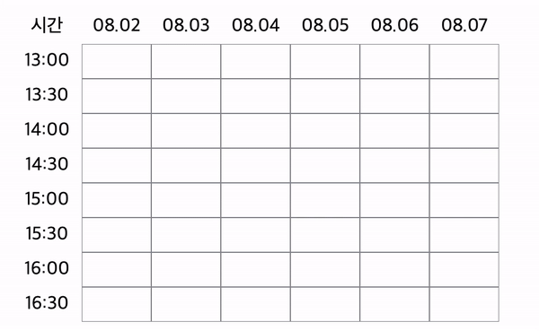
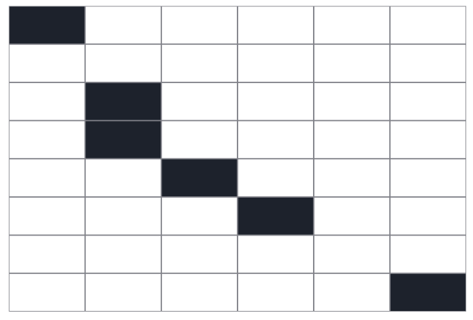
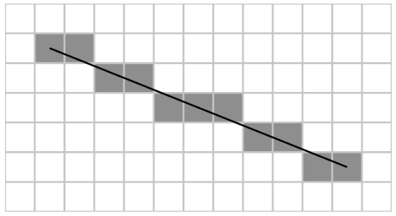
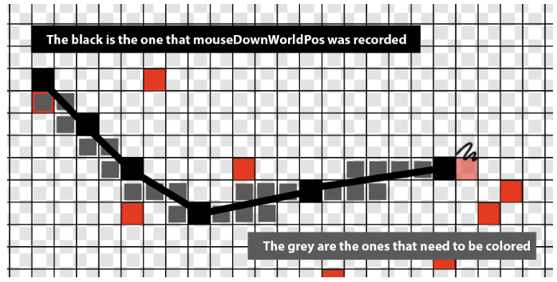
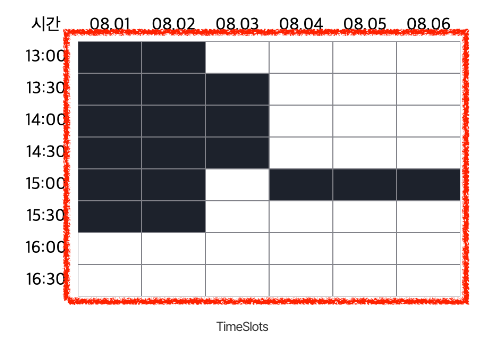

## Live demo & package

- [NPM react draggable selector](https://react-draggable-selector.vercel.app/)

## 들어가며

드래그로 슬롯들을 선택해야하는 컴포넌트를 구현해보자.

일반적으로 선택하고 싶은 영역을 클릭으로 선택하는 간단한 경우와 다르게, 드래그 행동을 통해 원하는 영역을 선택하기 때문에 선택과 관련된 여러 이벤트(click, mouseUp, mouseDown 등) 처리를 잘 해줘야 하는 컴포넌트라고 느꼈다.

특히 마우스가 `mouseUp` 되었을 때만 실제 데이터가 저장되어야 하는데, 드래그하는 와중에는 이리저리 이동할 수 있기 때문에 선택 가능성이 있는 슬롯들(마우스 업 이전에 임시로 선택된 슬롯들)을 어떻게 관리하면 좋을지 고민해보았다.

### **간단한 사양 및 기본 동작**

사용자가 기본적으로 할 수 있는 행위는 무엇일까?

슬롯들을 드래그하면 해당하는 슬롯들이 선택되고, 선택된 슬롯들을 다시 드래그하면 선택이 해제된다.

---

### **과정 1**

#### **Q. 현재 마우스는 어떤 슬롯 위에 있는가?**

현재 마우스 포인터가 어떤 슬롯 위에 있는지 알고 싶어서 `mouseEnter` 이벤트를 각각의 셀에 걸어주었다.

마우스 포인터가 각 슬롯에 닿을 때 행동이 일어나는 것이 더 적합하다고 생각했고, 각 슬롯이 가장 작은 단위이기도 했다.

또한 `mouseMove`와는 다르게 이벤트 발생 시 버블링이 일어나지 않아 해당 요소만이 이벤트를 받을 수 있기 때문에 사용했다.

그래서 `isDragging` 값을 줘서 `mouseDown` 상태부터 `mouseUp` 상태 사이에 있을 때 마우스가 이동한 슬롯들이 색칠되도록 하려고 했다.

```javascript
const handleMouseEnter = useCallback((endedTimeSlot: TimeSlot) => {
  // 슬롯 색칠
}, []);

// ...

<Cell
  onMouseEnter={() => {
    handleMouseEnter(timeSlots[colIndex]);
  }}
/>;
```

하지만 마우스가 빠른 속도로 이동하면(화면이 갱신되는 속도가 빠르면) 브라우저는 모든 마우스 위치를 정확히 추적할 수 없어 다음과 같이 끊김 현상이 일어났다.



---

### **과정 2**

#### **Q. 그렇다면 직선을 그을 수는 없나?**

드로잉 이슈에서 관련된 문제가 있었던 것 같아 찾아보니, 시작점과 끝점의 기울기를 기준으로 같은 직선에 있는 셀들을 예측하여 칠해줄 수 있는 **브레젠험 직선 알고리즘**이 있었다.

- [브레젠험 직선 알고리즘(Bresenham's Line Algorithm) 설명 블로그](https://velog.io/@octo__/브레젠험-직선-알고리즘Bresenhams-line-algorithm)
- [관련 GitHub 이슈](https://github.com/hunkim98/dotting/issues/36)





검정색은 `mouseDown`으로 인해 색칠된 픽셀들이고, 회색은 색칠되었어야 했는데 색칠되지 못한 픽셀들이다.

간단히 말하면, 색칠된 픽셀들 중 시작점과 종료점을 주면 직선의 방정식이 나오고, 해당 위치에 있는 픽셀들을 색칠하여 업데이트해주면 된다.

자세한 내용은 위의 이슈와 블로그에 잘 나와 있으니 참고하면 좋을 것 같다.

---

### **과정 3**

#### **Q. '여기서부터 ~ 여기까지 드래그해서 선택'의 느낌이 부족하다.**

여기까지 진행했는데, 막상 'selector'라는 이름을 붙여 사용하려니 좀 이상했다.

가로와 세로를 선택할 때는 큰 문제가 없었지만, 대각선을 선택할 때 대각선을 그리는 의도와 칠해지는 영역이 다른 것 같았다.

그림판처럼 마우스가 지나온 자리만 선택할 수 있게 하려는 의도는 아닌 것 같고, 실제 마우스 드래그 할 때처럼 범위 선택이 가능하게 하는 것이 더 목적에 맞고 사용성에도 좋을 것 같아 수정하게 되었다. 대각선, 가로, 세로에 해당하는 모든 슬롯들을 선택하고 싶을 것 같아 사용자 행동을 다시 정의했다.

> 슬롯들을 드래그하면 해당하는 슬롯들이 선택되고, 선택된 슬롯들을 다시 드래그하면 선택이 해제된다.

> 🚀 **대각선으로 드래그하면 시작지점과 종료지점에 해당하는 모든 행과 열이 사각형 모양으로 선택된다.**

[When2Meet](https://www.when2meet.com/)의 동작 방식을 참고하였다.

---

## 주요 구현 내용

### **Dependency**

스타일링을 위해 `styled-components`, 날짜 변환을 위해 `moment`(후에 `dayjs`로 교체)를 사용했다.

---

### **타입 소개**

기본적으로 프로젝트에서 날짜는 `Date[]`로 관리하고, 슬롯 하나는 `TimeSlot` 타입으로 관리하고 있다.

```typescript
export interface TimeSlot {
  date: string;
  startTime: string;
  endTime: string;
}
```

각 슬롯을 선택함에 있어 관련된 속성들은 `dragEventStates`로 관리한다.

```typescript
export enum Selection {
  ADD = "add",
  REMOVE = "remove",
}

export interface DragEventStates {
  selectionType: Selection | null;
  startedTimeSlot: TimeSlot | null;
  cachedSelectedTimeSlots: TimeSlot[];
}
```

드래그가 진행 중일 때는 선택된 영역을 바로 반영하고 싶지 않았다. 사용자가 드래그하는 동안 선택 영역이 계속 변하기 때문에, `mouseUp` 이벤트가 발생했을 때만 선택된 `TimeSlot`들을 반영해주고 싶어서 임시로 저장해줄 수 있는 캐시 배열을 사용했다. 또한 지금은 선택 즉시 반영되지만, 후에 드래그가 끝났을 때 필요한 경우 사용자에게 확인을 받거나 다른 절차가 있을 수 있어서 현재 드래그 중인 데이터들과 최종적으로 선택된 데이터들을 분리하기로 했다.

따라서 `cachedSelectedTimeSlots`는 드래그 이벤트를 처리하는 과정에서 선택된 시간 슬롯들을 임시로 저장하는 용도이고, 선택된 시간 슬롯들을 실제로 반영하기 전에 드래그 동작이 끝날 때까지 적용할 변경 사항들을 저장하는 데 사용된다.

---

### **TimeSlots 컴포넌트**

다음은 아래 사진과 같이 선택 영역들(빨간 네모)을 렌더링해주는 `TimeSlots` 컴포넌트로, `matrix`를 인자로 받아 테이블처럼 보여준다.

## 

### **Utils.ts**

다음은 조건에 맞는 데이터를 설정하거나 가져오거나 계산하는 유틸 함수들이다.

- **`areTimeSlotsEqual`**: 두 개의 시간 슬롯을 비교하여 동일한지 확인한다.
- **`isDateBetween`**: 특정 날짜가 시작 날짜와 종료 날짜 사이에 속하는지 여부를 확인한다.
- **`isTimeBetween`**: 특정 시간이 시작 시간과 종료 시간 사이에 속하는지 여부를 확인한다.
- **`getTimeSlotRecord`**: 주어진 날짜들과 시간 간격에 따라 시간 슬롯들을 `Record` 타입으로 생성한다(후에 `Map`으로 비교하면 시간을 줄일 수 있을 것 같아 작성, 수정 예정).
- **`getTimeSlotMatrix`**: 위에서 생성한 시간 슬롯 레코드를 기반으로 날짜별 시간 슬롯들을 행렬 형태로 구성한다.
- **`updateCachedSelectedTimeSlots`**: 드래그 이벤트에 따라 선택된 시간 슬롯들을 업데이트한다. 드래그가 시작된 슬롯과 종료된 슬롯을 비교하여 그 사이에 있는 시간 슬롯들을 선택 또는 해제한다.

`updateCachedSelectedTimeSlots`에 대해 좀 더 설명하자면, 주어진 드래그 이벤트 상태를 기반으로 선택된 시간 슬롯들을 업데이트하고, 업데이트된 선택된 시간 슬롯들과 기존의 슬롯을 비교해 캐시된 배열 상태로 업데이트해준다.

> - `startedTimeSlot`, `selectionType`이 없는 경우, 즉 드래그 이벤트가 시작되지 않았거나 선택 유형이 지정되지 않은 경우 함수가 종료된다.
> - 드래그 이벤트가 시작된 경우, `startedTimeSlot`과 `endedTimeSlot`을 이용하여 선택된 시간 슬롯들을 계산한다.
> - `selectionType`에 따라 다음과 같은 동작을 수행한다.
>   - `Selection.ADD`: 기존의 `selectedTimeSlots` 배열과 새롭게 계산된 선택된 시간 슬롯들을 합친다.
>   - `Selection.REMOVE`: `selectedTimeSlots`에서 새롭게 계산된 선택된 시간 슬롯들을 제거한다.
>   - 기타 경우: 현재의 `selectedTimeSlots` 배열을 유지한다.
> - 업데이트된 선택된 시간 슬롯들을 `cachedSelectedTimeSlots`에 반영한다.

결과적으로 `updateCachedSelectedTimeSlots` 함수를 사용하여 드래그 이벤트에 따라 선택된 시간 슬롯들을 쉽게 업데이트할 수 있고, 이 함수는 React 컴포넌트에서 드래그 이벤트 핸들러 등과 함께 사용되어 시간 슬롯 선택과 관련된 로직을 처리하는 데 활용된다.
